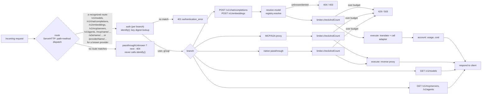

# traefik-llmgateway

A [Traefik](https://traefik.io) middleware plugin that turns a Traefik
instance into a multi-provider LLM gateway: one endpoint, several upstream
providers, per-user API keys organised into groups, request/token/cost
limits, and a registry plus authenticated proxy for in-cluster MCP servers
and A2A agents.

The plugin is self-contained. It has no sidecar and no companion service.
It runs as a [Yaegi](https://github.com/traefik/yaegi)-interpreted Go
module, the same way [`traefikoidc`](https://github.com/lukaszraczylo/traefikoidc)
does, configured per-middleware in Traefik's dynamic configuration.

**Status:** feature-complete, all gates green (unit tests, `-race`,
`yaegi-check`, integration). Not yet published to the Traefik Plugin
Catalog — see [Development](#development) for what that needs.

## What it is

- A unified, OpenAI-compatible surface (`/v1/chat/completions`,
  `/v1/embeddings`, `/v1/models`) that translates requests and responses to
  and from Anthropic's and Google Gemini's own wire formats, so any
  OpenAI-SDK-compatible client can talk to all three providers through one
  API shape.
- Native passthrough per provider (`/{provider}/...`) for callers that want
  a provider's own wire format untouched, with the gateway injecting that
  provider's own API key and still enforcing auth and limits.
- Per-user API keys, organised into groups that control which providers,
  models, MCP servers, and agents a user can reach, plus request/token/cost
  limits enforced per user and per group.
- A registry and authenticated reverse proxy for MCP servers and A2A
  agents, so those can sit behind the same gateway, the same auth, and the
  same group-based visibility rules as the LLM traffic.



Every route the plugin recognises is handled entirely inside the
middleware — `next` (the router's configured backing service) is only
reached when a request matches none of the plugin's routes and
`passthroughUnknown` is `true`.

## Quickstart

### Static configuration

The plugin is not yet in the Traefik Plugin Catalog (see
[Development](#development)), so the catalog form of static configuration
(`experimental.plugins.llmgateway`) is not usable yet. Until then, load it
as a [`localPlugin`](https://doc.traefik.io/traefik/plugins/#defining-a-local-plugin),
mounting this repository's source into the Traefik container at
`<plugins-local dir>/src/github.com/lukaszraczylo/traefik-llmgateway` — see
[`examples/docker-compose.yml`](examples/docker-compose.yml) for a
working, tested setup that does exactly this:

```yaml
# traefik static config (traefik.yml / --experimental.localPlugins.*)
experimental:
  localPlugins:
    llmgateway:
      moduleName: github.com/lukaszraczylo/traefik-llmgateway
```

Once the plugin is published, the catalog form replaces this:

```yaml
experimental:
  plugins:
    llmgateway:
      moduleName: github.com/lukaszraczylo/traefik-llmgateway
      version: "v0.1.0" # substitute the tag you actually deploy
```

### Dynamic configuration

A minimal single-provider middleware, one group, one user:

```yaml
http:
  middlewares:
    llmgateway:
      plugin:
        llmgateway:
          providers:
            openai:
              type: openai
              apiKey: "env:OPENAI_API_KEY"
              models: ["gpt-5-mini", "gpt-4o"]
          groups:
            default:
              providers: [] # empty = every configured provider is allowed
          users:
            inline:
              - name: alice
                group: default
                apiKey: "env:LLMGW_KEY_ALICE"
```

> Write an "allow everything" group as `providers: []` (an explicit empty
> list), not a bare `{}`. See the note at the top of
> [`examples/kubernetes.yaml`](examples/kubernetes.yaml) — confirmed
> against Traefik's **file provider**, twice, with this exact plugin build:
> a bare `default: {}` fails plugin construction with
> `expected a map, got 'string'`; `default: {providers: []}` loads cleanly.
> Not tested against the Docker/ECS label providers or the Kubernetes CRD
> provider — no claim either way for those. An explicit empty list means
> the same thing as an empty object (all values allowed), so writing it
> this way costs nothing even where the bug does not apply.

Attach the middleware to a router the same way as any other Traefik
middleware. The router's backing service is never actually reached unless
`passthroughUnknown: true` and the request matches none of the plugin's
routes — a small dummy service (`traefik/whoami`, or any always-up
internal service) is enough.

Call it:

```sh
curl http://llm.example.com/v1/chat/completions \
  -H "Authorization: Bearer $LLMGW_KEY_ALICE" \
  -H "Content-Type: application/json" \
  -d '{"model":"gpt-5-mini","messages":[{"role":"user","content":"hi"}]}'
```

## Full configuration reference

Every limit or visibility list follows one convention throughout: **empty
or omitted means unlimited / all**. Field names below are the exact JSON
keys the plugin's Go structs expect (`llmgateway.go`); Traefik's dynamic
config accepts them as YAML, which decodes to the same JSON shape.

### `Config` (top level)

| Field | Type | Default | Semantics |
|---|---|---|---|
| `providers` | `map[string]ProviderConfig` | — | Required, at least one entry, or the plugin refuses to construct. |
| `groups` | `map[string]GroupConfig` | `{}` | Optional. A user references one group by name; an unknown reference is a construction error. |
| `pricing` | `map[string]ModelPricing` | `{}` | Per-model USD/1M-token overrides, keyed by model id (bare or `provider/model`). Merged over, not replacing, the built-in table (`pricing.go`). |
| `mcpServers` | `map[string]TargetConfig` | `{}` | MCP server registry; see [MCP/A2A](#mcp-and-a2a). |
| `agents` | `map[string]AgentConfig` | `{}` | A2A agent registry; see [MCP/A2A](#mcp-and-a2a). |
| `users` | `UsersConfig` | — | Inline and/or file-backed API-key holders. With none configured, every request is unauthenticated and gets 401. |
| `redis` | `RedisConfig` | — | Distributed limit-counter backend. Omitted means in-process counters only (per-replica, approximate across multiple Traefik instances). |
| `passthroughUnknown` | `bool` | `false` | `false`: a request matching none of the plugin's routes gets a 404 JSON envelope. `true`: it falls through to the router's own backing service. |

Provider, `mcpServers`, and `agents` map **keys** (names) must match
`^[a-zA-Z0-9._-]+$` and must not be `v1`, `mcp`, or `a2a` — those names are
reserved because they would shadow the gateway's own fixed routes
(`/v1/...`, `/mcp/{name}/...`, `/a2a/{name}/...`); a name that collides is
a construction error, not a silently-unreachable provider. A `nil` map
*value* under any of `providers`, `groups`, `mcpServers`, or `agents` is
also a construction error, never a panic (`providers.go`, `mcp_a2a.go`,
`auth.go`).

### `ProviderConfig`

| Field | Type | Default | Semantics |
|---|---|---|---|
| `type` | `string` | — | Required: `openai`, `anthropic`, or `gemini`. `openai` also serves any OpenAI-wire-compatible provider (Grok, DeepSeek, a local vLLM/Ollama gateway, ...) via `baseUrl`. |
| `baseUrl` | `string` | Per type: `https://api.openai.com`, `https://api.anthropic.com`, `https://generativelanguage.googleapis.com` | Trailing slash trimmed. |
| `apiKey` | `string` | — | Secret form: literal, `env:VAR`, or `file:/path` — see [Secret forms](#secret-forms). An `openai`-type provider resolving to an empty key is a valid **keyless** upstream (no `Authorization` header sent) — useful for a local model server with no auth. `anthropic` and `gemini` reject an empty resolved key at construction. |
| `discoveryInterval` | `string` (Go duration) | `1h` | Only meaningful when `discovery: true`. Invalid duration string is a construction error. |
| `models` | `[]string` | `[]` | Explicit model ids this provider serves. Combined with any discovered ids. |
| `discovery` | `bool` | `false` | Pull the provider's own model-listing endpoint at startup and on `discoveryInterval`. A discovery failure is logged and non-fatal; construction still succeeds on `models` alone. |

### `GroupConfig`

| Field | Type | Default | Semantics |
|---|---|---|---|
| `limits` | `*LimitsConfig` | `nil` (unlimited) | |
| `providers` | `[]string` | `[]` (all) | Glob-matched (`path.Match`) against a provider's configured name. |
| `models` | `[]string` | `[]` (all) | Glob-matched, exactly as given — no automatic `provider/` prefix stripping. Both the bare and provider-prefixed forms of a model id are checked, so a pattern like `gpt-*` matches a client request for either `gpt-5-mini` or `openai/gpt-5-mini`. |
| `mcpServers` | `[]string` | `[]` (all) | Glob-matched against a configured MCP server name. |
| `agents` | `[]string` | `[]` (all) | Glob-matched against a configured agent name. |

### `LimitsConfig`

All six fields default to `0` (unlimited). A negative count, or a cost
that is negative, `NaN`, or `±Inf`, is a construction error.

| Field | Type | Window |
|---|---|---|
| `requestsPerMinute` | `int64` | Fixed 1-minute window, UTC. |
| `requestsPerDay` | `int64` | Fixed calendar-day window, UTC midnight to midnight. |
| `tokensPerDay` | `int64` | Fixed calendar-day window, UTC. |
| `tokensPerMonth` | `int64` | Fixed calendar-month window, UTC. |
| `costPerDayUSD` | `float64` | Fixed calendar-day window, UTC. |
| `costPerMonthUSD` | `float64` | Fixed calendar-month window, UTC. |

A user's own `limits`, when set, are checked **in addition to** their
group's limits, not instead of them — a request is refused the moment it
breaches whichever of the two is tighter. A user with no `limits` of their
own is governed purely by their group's — see
[UserConfig](#userconfig).

### `UsersConfig`

| Field | Type | Default | Semantics |
|---|---|---|---|
| `file` | `string` | — | Path to a JSON users file, merged over `inline` and hot-reloaded — see [Users file](#users-file-format). |
| `inline` | `[]UserConfig` | `[]` | Resolved once at plugin construction. |

### `UserConfig`

| Field | Type | Default | Semantics |
|---|---|---|---|
| `name` | `string` | — | Required. |
| `group` | `string` | — | Required; must reference a configured group, or construction fails. |
| `apiKey` | `string` | — | Secret form (see [Secret forms](#secret-forms)); must resolve non-empty and unique across every inline **and** file-sourced user. |
| `limits` | `*LimitsConfig` | `nil` (governed by group's limits alone) | When set, enforced alongside — not instead of — the group's own limits; both scopes are checked, and the request is refused by whichever is breached first. |

### `RedisConfig`

| Field | Type | Default | Semantics |
|---|---|---|---|
| `address` | `string` | — | Required when the `redis` block is present at all. `host:port`, RESP protocol — works against Redis, [Valkey](https://valkey.io), or [Dragonfly](https://www.dragonflydb.io). |
| `password` | `string` | `""` (no `AUTH`) | Secret form. |
| `db` | `int` | `0` | Must be `≥ 0`. Sent via `SELECT` on every new connection. |
| `failOpen` | `*bool` | `true` | `true`: a Redis error switches that operation to the in-process fallback store and logs (rate-limited to once per 30s). `false`: a Redis error returns 503 instead of enforcing against a non-shared fallback. |

### `ModelPricing`

| Field | Type | Semantics |
|---|---|---|
| `inputPerM` | `float64` | USD per 1,000,000 input/prompt tokens. |
| `outputPerM` | `float64` | USD per 1,000,000 output/completion tokens. |

### `TargetConfig` (an `mcpServers` entry)

| Field | Type | Semantics |
|---|---|---|
| `url` | `string` | Required; must parse with an `http` or `https` scheme, checked at construction. |

### `AgentConfig` (an `agents` entry)

| Field | Type | Default | Semantics |
|---|---|---|---|
| `url` | `string` | — | Required; same URL validation as `TargetConfig`. |
| `card` | `string` | `/.well-known/agent-card.json` | Path appended to the agent's gateway-relative proxy URL for its A2A agent-card listing. |

### Secret forms

Every `apiKey`/`password` field accepts one of three forms
(`secrets.go`):

- **Literal** — the value itself, used as-is. Fine for local/dev; avoid for
  anything real.
- **`env:VAR`** — read from environment variable `VAR` on the Traefik
  process. Errors if unset or empty.
- **`file:/path`** — read from a file, trimmed of surrounding whitespace.
  Errors if unreadable or the trimmed content is empty.

Provider keys, Redis's password, and inline users' keys are resolved
**once**, at plugin construction. A file-sourced user's `apiKey` is
re-resolved on every hot reload (see below), so it can use `env:`/`file:`
forms too and pick up a rotated value without a Traefik restart.

### Users file format

One JSON object, one `users` array, mounted from a single Kubernetes
Secret (`users_file.go`):

```json
{
  "users": [
    {"name": "alice", "group": "engineering", "apiKey": "sk-llmgw-..."},
    {"name": "bob", "group": "general", "apiKey": "env:LLMGW_KEY_BOB", "limits": {"requestsPerDay": 100}}
  ]
}
```

A file user with the same `name` as an inline user overrides it (the
inline entry is dropped from the merged set). Hot reload polls the file's
mtime, throttled to once per 5 seconds on the request path, and is
best-effort: a reload already in progress is skipped rather than
serialising every concurrent request behind it, so a change lands within a
few request-driven checks, not necessarily on the very next one. A
reload's own error (unreadable file, malformed JSON, a user referencing an
unknown group, a duplicate key) is logged and the last good user set is
kept — a bad edit to the file never breaks already-authenticated traffic.

## Model routing

- A model id in **`provider/model`** form resolves directly against that
  provider, but only when the part before the slash names an actually
  configured provider. Any other id — including one that merely contains a
  slash, such as an upstream's own `uni/deepseek-v4-flash-0731` naming — is
  treated as a single **bare** id.
- A bare id resolves against the first configured provider, in sorted
  provider-name order, whose known model set (explicit `models` plus any
  discovered ids) contains it. When more than one provider knows the same
  bare id, the sorted-first provider wins it and the gateway logs a
  collision warning once per id; every provider's copy stays reachable
  through the explicit `provider/model` form regardless of who won the
  bare id, and `GET /v1/models` lists both the bare (winner's) form and
  every `provider/model` form.
- Authorization always requires both `group.allowsModel` and
  `group.allowsProvider` for the resolved provider — a model that exists
  but the caller's group cannot reach returns 403, distinct from a model no
  configured provider knows at all (404).
- **Discovery**: `GET {baseUrl}/v1/models` for an `openai`-type provider,
  `GET {baseUrl}/v1/models` for `anthropic`, `GET {baseUrl}/v1beta/models`
  for `gemini`. Runs once at plugin construction (bounded to 5s per
  provider) and again on `discoveryInterval` in the background. A failed
  refresh is logged and keeps the provider's last-known discovered set —
  **stale-while-error**, never an empty list just because one refresh
  attempt failed.

## Limits and accounting

- Counters use **fixed windows**, keyed by UTC calendar boundaries (the
  minute, the day, the month) — not a sliding window. Requests-per-minute
  and requests-per-day counters increment **before** evaluation, so every
  request counts toward its scopes' rate tracking even if it is ultimately
  refused by a different scope's limit.
- Token and cost budgets are checked against the value **already
  accumulated** from prior requests, before this request's own usage is
  known (usage only arrives after the upstream call completes). A request
  that would start already over budget is refused; a request that starts
  under budget but pushes the scope over it is still allowed to complete —
  an accepted at-most-one-request overshoot, not an exactly-enforced cap.
- **Accounting** parses usage from the provider's own response: OpenAI-type
  `usage`, Anthropic `usage` (from `message_start`/`message_delta`), Gemini
  `usageMetadata`. When a **non-streaming** unified-route response reports
  no usage at all, the gateway falls back to a rough estimate —
  `ceil(request-body-bytes / 4)` counted as prompt tokens, no completion
  estimate — and marks it `estimated`. A **streaming** unified-route
  response with no usage is logged and the request itself is still
  counted, but no token estimate is applied.
- Cost is `tokens × price`, computed in integer **micro-USD**
  (1,000,000ths of a dollar) throughout to avoid float drift, from the
  built-in per-model table (`pricing.go`) or a configured `pricing`
  override. An unpriced model costs 0 and logs a once-per-model warning
  (capped at 128 distinct unpriced model names per process lifetime, then
  one summary warning). The built-in table is **approximate** — list
  prices as each provider published them, recorded 2026-08, and not kept
  in sync automatically. Set `pricing` overrides for billing-grade
  accuracy.
- **Storage**: `redis` configured wires a hand-rolled, stdlib-only RESP2
  client (`resp.go`) — no `go-redis`, which is not Yaegi-interpretable —
  against Redis, Valkey, or Dragonfly. Semantics are deliberately
  **at-least-once, never under-counting**: a lost reply after the server
  already applied an `INCRBY` can cause a resend that over-counts by one
  request's worth on that key. This is a fail-*safe* trade-off (more
  restrictive than reality), never a fail-*open* one. Without `redis`
  configured, or when it errors and `failOpen: true`, counters live in an
  in-process map — correct for one Traefik replica, only approximate
  across several, since each replica counts independently. Exact limits
  across multiple Traefik replicas require the shared Redis.

## Unified vs. passthrough

| | Unified (`/v1/...`) | Native passthrough (`/{provider}/...`) |
|---|---|---|
| Wire format | Always OpenAI-shaped in, OpenAI-shaped out. | The provider's own native format, untouched. |
| Translation | `openai`-type: body forwarded verbatim (model id rewritten). `anthropic`/`gemini`: full bidirectional translation, including streaming, chunk by chunk. | None — a raw reverse proxy. |
| Model alias in the response | Translated providers (`anthropic`, `gemini`) echo back the client's exact requested model string in the response's `model` field, even though the upstream call used the resolved provider model id. An `openai`-type response is a verbatim passthrough of the upstream body, so it carries whatever model id the upstream itself returned — this asymmetry is intentional, not a bug. | The upstream's own `model` field, verbatim — there is no alias to echo. |
| Embeddings | `openai`-type: passthrough. `gemini`: mapped to `:embedContent`/`:batchEmbedContents`. `anthropic`: **501** — Anthropic's API has no embeddings endpoint. | Whatever the provider itself supports at that path; the gateway does not gate it. |
| Unsupported parameters | A semantically meaningful field the target provider cannot express (e.g. `n > 1`, `logit_bias`, `logprobs` on Anthropic) is a **400**, never silently dropped. | Not applicable — the request reaches the provider exactly as sent. |
| Non-2xx upstream response | Wrapped in the gateway's own error envelope, with the provider's own body embedded under `error.upstream`. | Forwarded to the client exactly as the upstream sent it — status, headers, and body. |

## MCP and A2A

- **Registry** (group-filtered, sorted by name):
  `GET /v1/mcp/servers` → `{"servers":[{"name","url"}]}`;
  `GET /v1/agents` → `{"agents":[{"name","url","card"}]}`.
- **Proxy**: `/mcp/{name}/{rest...}` and `/a2a/{name}/{rest...}`
  reverse-proxy `{rest...}` to the configured target's `url`, streaming
  (SSE) preserved via a flush-per-write proxy. The gateway's own
  `Authorization`/`x-api-key` credential is stripped before proxying, and
  — unlike native provider passthrough — **no credential is injected** on
  the way out: an MCP server or A2A agent is treated as an in-cluster
  target that trusts the gateway's network position, not a per-provider
  key the gateway holds on the caller's behalf.
- Request-rate limits (`requestsPerMinute`/`requestsPerDay`) apply to
  target-proxy calls the same as everywhere else; token/cost metrics do
  not, since there is no usage to parse from an arbitrary MCP/A2A
  response.
- Group visibility (`mcpServers`/`agents` glob lists) gates both the
  registry listing and the proxy path itself — a denied name is a 403 at
  the proxy, not just hidden from the listing.

## Security notes

- API keys are never retained in memory as plaintext after construction —
  only their SHA-256 digests. Lookup is by digest, verified with
  `crypto/subtle.ConstantTimeCompare` against the stored digest, so
  matching does not leak timing information about a near-miss key.
- Provider API keys are injected server-side (native passthrough's
  `injectAuth`) and never reach the client; a client's own gateway key is
  stripped before any upstream or target request and never reaches a
  provider, MCP server, or A2A agent.
- Neither kind of key is ever written to a log line — the logging helpers
  (`logger.go`) carry an explicit "never log key material" contract.
  `providerHTTPError`'s `Error()` string (`providers.go`) separately omits
  the upstream response body it still holds as a struct field, so a future
  caller that ever formats the error bare (`%v`) cannot accidentally echo
  provider response content into a log line; today's only caller
  (`writeProviderUpstreamError`) reads that body directly and puts it in
  the client-facing response, never in a log.
- **Every authentication attempt is logged**, through one shared helper
  (`logAuthEvent`, `logger.go`) called at each of the six routes that
  authenticate a request (`llmgateway.go`'s `ServeHTTP`, and
  `routes_unified.go`'s `handleModels`). A failed attempt logs the request
  method, path, and remote address, and returns the usual 401 JSON
  envelope. A successful attempt logs the resolved user's name and the
  route. Neither line ever includes the presented API key — only the
  identity it resolved to, never the key material itself.

## Known limitations

- **Streaming is delivered buffered, not token-by-token, under the current
  Traefik + Yaegi combination.** The plugin's own code streams correctly
  (proven by its unit tests, which drive the exact same code compiled, not
  interpreted): content is always complete and correct, but a Yaegi
  limitation strips the `http.Flusher` interface from the
  `http.ResponseWriter` crossing from Traefik's compiled dispatcher into
  the interpreted plugin, so no per-chunk flush actually reaches the
  client — the whole response arrives in one batch once the handler
  returns. This is a confirmed, external, still-open upstream bug
  ([traefik/traefik#10269](https://github.com/traefik/traefik/issues/10269),
  labelled `kind/bug/confirmed` by Traefik's own maintainers; see also
  [traefik/yaegi#1600](https://github.com/traefik/yaegi/issues/1600)), not
  a defect in this plugin, and no code-level workaround is known. The
  integration suite's true incremental-delivery timing assertion is gated
  behind `INTEGRATION_STREAMING=1` and skipped by default for exactly this
  reason — re-run it once the upstream issue is fixed.
- **A request rejected before it reaches a provider never consumes
  request-rate quota.** On the unified routes, a malformed body, a missing
  `model` field, or an unknown/denied model (404/403) is rejected before
  `limiter.checkAndCount` runs. On native passthrough and the MCP/A2A
  proxy, denied provider/target access (403), an unsupported `Upgrade`
  request (501), and a path-traversal attempt (400) are all checked before
  the limiter too. Once a request *does* reach a provider adapter,
  though, a translate-time 400 (an unsupported parameter combination) or
  Anthropic's embeddings 501 still count toward the caller's request-rate
  limit — the limiter already ran by then — though neither ever bills a
  token or cost, since usage stays at zero either way.
- **Gateway-to-client responses on passthrough and MCP/A2A routes are
  identity-encoded.** The gateway strips a client's own `Accept-Encoding`
  header before forwarding to the upstream, so Go's `http.Transport` adds
  its own `Accept-Encoding: gzip` and, per its documented contract,
  transparently decompresses a gzip response and strips its
  `Content-Encoding`/`Content-Length` headers before handing it back — the
  client sees plain, uncompressed bytes with no `Content-Encoding` header,
  regardless of what it originally asked for. This covers the gzip case
  Go's `Transport` auto-negotiates; an upstream that used a different
  encoding on its own initiative (never observed against OpenAI,
  Anthropic, or Gemini) would pass through unmodified instead.

## Kubernetes

See [`examples/kubernetes.yaml`](examples/kubernetes.yaml) for a complete,
YAML-validated example manifest that `kubectl apply -f` applies cleanly
once Traefik's CRDs (`Middleware`, `IngressRoute`) are installed in the
cluster: a `Secret` holding the users file, a `Middleware` custom resource
carrying the plugin's own configuration (validated against the real `Config`
struct — every field in that example round-trips through `New()`
cleanly), a dummy backing `Deployment`/`Service` (Traefik requires a real
router backend even though this middleware never actually reaches it —
see [Quickstart](#quickstart)), an `IngressRoute` wiring it all to a
host, and a Traefik Helm values snippet for loading the plugin and
wiring provider keys in from Secrets via environment variables.

The short version:

- Provider keys and the Redis password live in `env:VAR` form inside the
  `Middleware`, sourced from Kubernetes `Secret`s mounted as environment
  variables on the Traefik pod — never as literals in the CR.
- The users file lives in its own `Secret`, mounted as a volume, referenced
  by `users.file` in the `Middleware` spec. Editing that `Secret` (and
  letting it propagate to the mounted file, or restarting the pod if your
  cluster's kubelet doesn't sync `Secret` volumes fast enough for your
  needs) updates the live user set within the 5-second reload window — no
  Traefik restart required.
- Point `redis.address` at your cluster's existing Redis/Valkey/Dragonfly
  rather than standing up a dedicated instance for this plugin — the
  distributed limiter is a client, not a datastore.

## Development

```sh
make test            # go test ./... -count=1
make lint            # gofmt -l . && go vet ./...
make yaegi-check      # interprets the plugin with Yaegi, exercises .traefik.yml's testData
make integration      # docker-compose: real Traefik, real Redis, mock providers; brings the
                      # stack up, waits for it, runs the suite, always tears it down after
make integration-keep # same run, but leaves the stack up afterward for debugging —
                      # tear it down yourself with `make integration-down` when done
```

Also run before committing (not wired into `make lint`, since it needs a
separate binary): `golangci-lint run ./...` and
`golangci-lint run --enable=gosec ./...` (gosec applies to `_test.go`
files too), plus `fieldalignment ./...`
([`golang.org/x/tools/go/analysis/passes/fieldalignment`](https://pkg.go.dev/golang.org/x/tools/go/analysis/passes/fieldalignment)).
All are 0-issues on this repository as of this commit.

The plugin ships stdlib-only (no third-party dependencies at all, see
`go.mod`) — a hard constraint of Yaegi interpretation, not a style
preference. [`resp.go`](resp.go) is the clearest example: a hand-rolled,
~400-line RESP2 client instead of `go-redis`, which the design doc records
as unsuitable for Yaegi interpretation
(`docs/superpowers/specs/2026-08-19-traefik-llmgateway-design.md`, §7).

### Catalog submission

[`.traefik.yml`](.traefik.yml) is in place, with a `basePkg` override
(`traefikllmgateway`) required because Traefik's Yaegi middleware loader
otherwise binds the interpreted package under
`strings.ReplaceAll(path.Base(import), "-", "_")` — `traefik_llmgateway`
— which does not match this package's actual `package traefikllmgateway`
declaration. This was discovered running the plugin in real Traefik for
the first time; see the comment in `.traefik.yml` itself. **The Plugin
Catalog's own analyzer (piceus) has not yet been run against this
repository** — whether it accepts the same `basePkg` override the same
way real Traefik does is unverified until actual submission.

## License

[MIT](LICENSE) — Copyright (c) 2026 Lukasz Raczylo.
