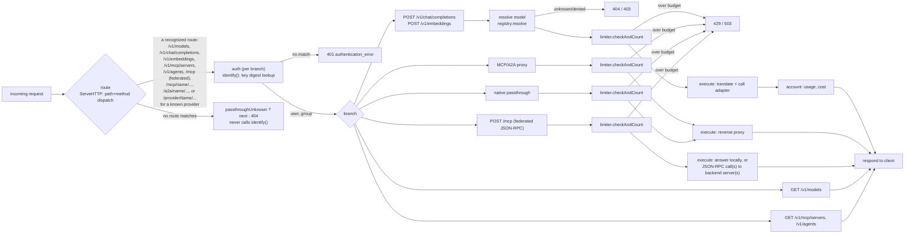

# traefik-llmgateway

A [Traefik](https://traefik.io) middleware plugin that turns a Traefik
instance into a multi-provider LLM gateway: one endpoint, several upstream
providers, per-user API keys organised into groups, request/token/cost
limits, and a registry plus authenticated proxy for in-cluster MCP servers
and A2A agents.

The plugin is self-contained. It has no sidecar and no companion service.
It runs as a [Yaegi](https://github.com/traefik/yaegi)-interpreted Go
module, the same way [`traefikoidc`](https://github.com/lukaszraczylo/traefikoidc)
does, configured per-middleware in Traefik's dynamic configuration.

**Status:** stable at **v1.0**. Configuration keys, endpoints, and
behaviour now follow semver — breaking changes wait for a major release
instead of landing between patches, as they could before 1.0.

Feature-complete, all gates green (unit tests, `-race`, `yaegi-check`,
integration), and published to the Traefik Plugin Catalog. One behaviour
worth knowing before you deploy: [streaming is delivered buffered rather
than token-by-token](#known-limitations) under the current Traefik + Yaegi
combination.

## What it is

- A unified, OpenAI-compatible surface (`/v1/chat/completions`,
  `/v1/embeddings`, `/v1/models`) that translates requests and responses to
  and from Anthropic's and Google Gemini's own wire formats, so any
  OpenAI-SDK-compatible client can talk to all three providers through one
  API shape.
- An Anthropic-compatible surface (`POST /v1/messages`) for Anthropic SDK
  clients — including Claude Code — to talk to any configured provider in
  Anthropic's own Messages API shape; see [Anthropic Messages API
  (`/v1/messages`)](#anthropic-messages-api-v1messages).
- Native passthrough per provider (`/{provider}/...`) for callers that want
  a provider's own wire format untouched, with the gateway injecting that
  provider's own API key and still enforcing auth and limits.
- Per-user API keys, organised into groups that control which providers,
  models, MCP servers, and agents a user can reach, plus request/token/cost
  limits enforced per user and per group.
- A registry and authenticated reverse proxy for MCP servers and A2A
  agents, so those can sit behind the same gateway, the same auth, and the
  same group-based visibility rules as the LLM traffic.

<details>
<summary><b>Request flow diagram</b> (mermaid — renders on GitHub)</summary>



</details>

Every route the plugin recognises is handled entirely inside the
middleware — `next` (the router's configured backing service) is only
reached when a request matches none of the plugin's routes and
`passthroughUnknown` is `true`.

## Quickstart

### Static configuration

The plugin is in the Traefik Plugin Catalog, so the catalog form of static
configuration works:

```yaml
experimental:
  plugins:
    llmgateway:
      moduleName: github.com/lukaszraczylo/traefik-llmgateway
      version: v1.0.3
```

You can also load it as a
[`localPlugin`](https://doc.traefik.io/traefik/plugins/#defining-a-local-plugin),
mounting this repository's source into the Traefik container at
`<plugins-local dir>/src/github.com/lukaszraczylo/traefik-llmgateway`.
That form tracks a branch instead of a pinned release, which suits
development and any deployment that wants to follow `main` — see
[`examples/docker-compose.yml`](examples/docker-compose.yml) for a
working, tested setup that does exactly this:

```yaml
# traefik static config (traefik.yml / --experimental.localPlugins.*)
experimental:
  localPlugins:
    llmgateway:
      moduleName: github.com/lukaszraczylo/traefik-llmgateway
```

The catalog form above pins a released tag instead, which is the better
default for production: a pod restart cannot pick up a change you have not
deployed on purpose.

### Dynamic configuration

A minimal single-provider middleware, one group, one user:

```yaml
http:
  middlewares:
    llmgateway:
      plugin:
        llmgateway:
          providers:
            openai:
              type: openai
              apiKey: "env:OPENAI_API_KEY"
              models: ["gpt-5-mini", "gpt-4o"]
          groups:
            default:
              providers: [] # empty = every configured provider is allowed
          users:
            inline:
              - name: alice
                group: default
                apiKey: "env:LLMGW_KEY_ALICE"
```

> Write an "allow everything" group as `providers: []` (an explicit empty
> list), not a bare `{}`. See the note at the top of
> [`examples/kubernetes.yaml`](examples/kubernetes.yaml) — confirmed
> against Traefik's **file provider**, twice, with this exact plugin build:
> a bare `default: {}` fails plugin construction with
> `expected a map, got 'string'`; `default: {providers: []}` loads cleanly.
> Not tested against the Docker/ECS label providers or the Kubernetes CRD
> provider — no claim either way for those. An explicit empty list means
> the same thing as an empty object (all values allowed), so writing it
> this way costs nothing even where the bug does not apply.

Attach the middleware to a router the same way as any other Traefik
middleware. The router's backing service is never actually reached unless
`passthroughUnknown: true` and the request matches none of the plugin's
routes — a small dummy service (`traefik/whoami`, or any always-up
internal service) is enough.

Call it:

```sh
curl http://llm.example.com/v1/chat/completions \
  -H "Authorization: Bearer $LLMGW_KEY_ALICE" \
  -H "Content-Type: application/json" \
  -d '{"model":"gpt-5-mini","messages":[{"role":"user","content":"hi"}]}'
```

## Full configuration reference

Every limit or visibility list follows one convention throughout: **empty
or omitted means unlimited / all**. Field names below are the exact JSON
keys the plugin's Go structs expect (`llmgateway.go`); Traefik's dynamic
config accepts them as YAML, which decodes to the same JSON shape.

### `Config` (top level)

| Field | Type | Default | Semantics |
|---|---|---|---|
| `providers` | `map[string]ProviderConfig` | — | Required, at least one entry, or the plugin refuses to construct. |
| `groups` | `map[string]GroupConfig` | `{}` | Optional. A user references one group by name; an unknown reference is a construction error. |
| `pricing` | `map[string]ModelPricing` | `{}` | Per-model USD/1M-token overrides, keyed by model id (bare or `provider/model`). Merged over, not replacing, the built-in table (`pricing.go`). |
| `mcpServers` | `map[string]TargetConfig` | `{}` | MCP server registry; see [MCP/A2A](#mcp-and-a2a). |
| `agents` | `map[string]AgentConfig` | `{}` | A2A agent registry; see [MCP/A2A](#mcp-and-a2a). |
| `users` | `UsersConfig` | — | Inline and/or file-backed API-key holders. With none configured, every request is unauthenticated and gets 401. |
| `redis` | `RedisConfig` | — | Distributed limit-counter backend. Omitted means in-process counters only (per-replica, approximate across multiple Traefik instances). |
| `retry` | `RetryConfig` | `{}` (disabled) | Same-provider retry for transient upstream failures — see [Retry](#retry). Omitted or `enabled: false` means no retry: every request makes exactly one upstream attempt, byte-identical to a gateway built before this field existed. |
| `failover` | `FailoverConfig` | `{}` (disabled) | Cross-provider failover for a bare model id more than one configured provider serves — see [Failover](#failover). Omitted or `enabled: false` means no failover, byte-identical to a gateway built before this field existed. `enabled: true` opts in; a deployment with no overlapping providers behaves exactly as before regardless of this setting either way. |
| `requestTimeout` | `string` (Go duration) | `5m` | Progress-based upstream request timeout, applied to every provider adapter call, native passthrough, and the MCP/A2A target proxy — see [Request timeout](#request-timeout). **Behavior change for every deployment**: before this field existed, no timeout was set at all, so a provider that accepted a connection and then went silent hung the request forever. A provider's own `requestTimeout` (`ProviderConfig`) overrides this. Empty means the default; a value that fails to parse, or parses to zero or a negative duration, is a construction error. |
| `cache` | `CacheConfig` | `{}` (disabled) | Opt-in Redis-backed response cache for unified non-streaming chat/embeddings — see [Caching](#caching). Omitted or `enabled: false` means no caching, byte-identical to a gateway built before this field existed. |
| `breaker` | `BreakerConfig` | `{}` (every default) | Per-provider discovery circuit breaker — see [Provider health (discovery circuit breaker)](#provider-health-discovery-circuit-breaker). Every field is individually zero-means-default; a provider whose discovery never fails is unaffected regardless of what this block contains. |
| `admin` | `*AdminConfig` | `nil` (disabled) | Read-only admin dashboard — see [Admin](#admin). `nil` or `enabled: false` means the `/admin*` routes are not registered at all. |
| `metrics` | `*MetricsConfig` | `nil` (disabled) | Prometheus text-exposition endpoint — see [Metrics](#metrics). `nil` or `enabled: false` means the metrics route is not registered at all. |
| `modelAliases` | `map[string]string` | `{}` | Operator-defined alias id → target model id — see [Model aliases](#model-aliases). Omitted or empty means no aliases, byte-identical to a gateway built before this field existed. |
| `modelMeta` | `map[string]*ModelMetaConfig` | `{}` | Per-model context-window and cost overrides, keyed by exact `provider/model` or a bare model id — see [Model metadata](#model-metadata). Omitted or empty means no overrides; every model's metadata still resolves through discovery and the built-in table. |
| `passthroughUnknown` | `bool` | `false` | `false`: a request matching none of the plugin's routes gets a 404 JSON envelope. `true`: it falls through to the router's own backing service. **Does not cover the three media routes** — see the upgrade note below. |
| `maxInFlightBodyRequests` | `int` | `0` (self-tuned) | Caps how many unified/media requests may concurrently be inside their own request-body read+decode step — see [Body-admission limit](#body-admission-limit). `0` self-tunes from the host's own `GOMAXPROCS`; a positive value pins an exact cap instead, clamped to a maximum of 10,000. |

> **Upgrading from v0.1**: `POST /v1/images/generations`, `POST
> /v1/audio/speech`, and `POST /v1/audio/transcriptions` are now handled by
> the gateway itself, unconditionally — see [Image and audio
> endpoints](#image-and-audio-endpoints). They no longer fall through to
> `next` even when `passthroughUnknown: true`. A v0.1 deployment that
> served its own backend on any of these three exact paths, relying on
> passthrough to reach it, must move that backend to a different path
> before upgrading to v0.2 — the gateway now intercepts these paths first,
> every time.

Provider, `mcpServers`, and `agents` map **keys** (names) must match
`^[a-zA-Z0-9._-]+$` and must not be `v1`, `mcp`, or `a2a` — those names are
reserved because they would shadow the gateway's own fixed routes
(`/v1/...`, `/mcp/{name}/...`, `/a2a/{name}/...`); a name that collides is
a construction error, not a silently-unreachable provider. A `nil` map
*value* under any of `providers`, `groups`, `mcpServers`, or `agents` is
also a construction error, never a panic (`providers.go`, `mcp_a2a.go`,
`auth.go`).

### `ProviderConfig`

| Field | Type | Default | Semantics |
|---|---|---|---|
| `type` | `string` | — | Required: `openai`, `anthropic`, or `gemini`. `openai` also serves any OpenAI-wire-compatible provider (Grok, DeepSeek, a local vLLM/Ollama gateway, ...) via `baseUrl`. |
| `baseUrl` | `string` | Per type: `https://api.openai.com`, `https://api.anthropic.com`, `https://generativelanguage.googleapis.com` | Trailing slash trimmed. |
| `apiKey` | `string` | — | Secret form: literal, `env:VAR`, or `file:/path` — see [Secret forms](#secret-forms). An `openai`-type provider resolving to an empty key is a valid **keyless** upstream (no `Authorization` header sent) — useful for a local model server with no auth. `anthropic` and `gemini` reject an empty resolved key at construction. |
| `discoveryInterval` | `string` (Go duration) | `1h` | Minimum time between discovery refreshes for this provider. Only meaningful when `discovery: true`. Refresh is checked on incoming requests, not by a background timer, so this is a floor rather than a schedule — see [Model routing](#model-routing). Invalid duration string is a construction error. |
| `models` | `[]string` | `[]` | Explicit model ids this provider serves. Combined with any discovered ids. |
| `discovery` | `bool` | `false` | Pull the provider's own model-listing endpoint at startup, then no more often than `discoveryInterval` when requests arrive. A discovery failure is logged and non-fatal; construction still succeeds on `models` alone. |
| `metadataPath` | `string` | `""` (no metadata capture) | Only read by `openai`-type providers. A second endpoint, fetched alongside `discovery`, that reports per-model context length — for example `/api/v0/models` on an LM Studio server. Must start with `/` when set (checked at construction). See [Model metadata](#model-metadata). |
| `passthrough` | `*bool` | `nil` (enabled) | `nil` or `true`: this provider's native passthrough route (`/{name}/...`) stays reachable, unchanged from before this field existed. `false`: the route is disabled — `ServeHTTP` treats it exactly like an unconfigured provider name, falling through to the ordinary unknown-route 404 without even reaching authentication. Does not affect the MCP/A2A target proxy, which has its own routing prefix. |
| `requestTimeout` | `string` (Go duration) | Inherits the top-level `requestTimeout` (`5m` if that is also unset) | Overrides the global request timeout for this provider alone, including its native passthrough route — see [Request timeout](#request-timeout). An explicit override always wins over the global default. Empty inherits; a value that fails to parse, or parses to zero or a negative duration, is a construction error. |

### `GroupConfig`

| Field | Type | Default | Semantics |
|---|---|---|---|
| `limits` | `*LimitsConfig` | `nil` (unlimited) | |
| `providers` | `[]string` | `[]` (all) | Glob-matched (`path.Match`) against a provider's configured name. |
| `models` | `[]string` | `[]` (all) | Glob-matched, exactly as given — no automatic `provider/` prefix stripping. Both the bare and provider-prefixed forms of a model id are checked, so a pattern like `gpt-*` matches a client request for either `gpt-5-mini` or `openai/gpt-5-mini`. |
| `cache` | `*bool` | `nil` (inherit) | Overrides the top-level `cache.enabled` setting for this group's requests — see [Caching](#caching). `nil` inherits the global setting; `false` opts the group out even when caching is globally on; `true` opts the group in, but only when the top-level `cache` block is actually configured (a construction error otherwise — there is nothing to inherit `ttl`/`maxBodyBytes` from). |
| `cacheTTL` | `string` | `""` (inherit) | Sets the TTL written when this group's own request populates a cache entry — see [Caching](#caching). It does not scope entries to a group: cache entries are shared across every group that can reach the model (see the Caching section's "User identity is not part of the key" note, which applies to group identity too), so this controls a write's TTL only, not which group can read the entry. Empty inherits the global TTL. A set value must be a valid, positive Go duration (`"30s"`, `"5m"`), and requires the top-level `cache` block to be configured — a construction error otherwise, the same "nothing to inherit from" reasoning as `cache: true` above. |
| `mcpServers` | `[]string` | `[]` (all) | Glob-matched against a configured MCP server name. |
| `agents` | `[]string` | `[]` (all) | Glob-matched against a configured agent name. |
| `passthroughPaths` | `[]string` | `[]` (all) | Restricts which REST path this group's **native passthrough** requests may address — glob-matched (`path.Match`) against the path segment after the provider name (e.g. `v1/files` for a request to `/openai/v1/files`). Empty is allow-all, matching every other field on this table — **not** `["*"]`: `path.Match`'s `*` does not cross `/`, so a literal `["*"]` pattern denies every multi-segment `rest` (almost all real passthrough traffic). Leave this unset to actually allow everything. See [Unified vs. passthrough](#unified-vs-passthrough) for the related model-authorization rule. |

### `LimitsConfig`

All six fields default to `0` (unlimited). A negative count, or a cost
that is negative, `NaN`, or `±Inf`, is a construction error.

| Field | Type | Window |
|---|---|---|
| `requestsPerMinute` | `int64` | Fixed 1-minute window, UTC. |
| `requestsPerDay` | `int64` | Fixed calendar-day window, UTC midnight to midnight. |
| `tokensPerDay` | `int64` | Fixed calendar-day window, UTC. |
| `tokensPerMonth` | `int64` | Fixed calendar-month window, UTC. |
| `costPerDayUSD` | `float64` | Fixed calendar-day window, UTC. |
| `costPerMonthUSD` | `float64` | Fixed calendar-month window, UTC. |

Every window enforces correctly on the in-process fallback too, not only Redis —
see [Limits and accounting](#limits-and-accounting)'s "Fallback" bullet for the
retention floor that keeps `tokensPerMonth`/`costPerMonthUSD` a true calendar-month
budget rather than a rolling one when Redis is absent or down.

A user's own `limits`, when set, are checked **in addition to** their
group's limits, not instead of them — a request is refused the moment it
breaches whichever of the two is tighter. A user with no `limits` of their
own is governed purely by their group's — see
[UserConfig](#userconfig).

### `UsersConfig`

| Field | Type | Default | Semantics |
|---|---|---|---|
| `file` | `string` | — | Path to a JSON users file, merged over `inline` and hot-reloaded — see [Users file](#users-file-format). |
| `inline` | `[]UserConfig` | `[]` | Resolved once at plugin construction. |

### `UserConfig`

| Field | Type | Default | Semantics |
|---|---|---|---|
| `name` | `string` | — | Required. |
| `group` | `string` | — | Required; must reference a configured group, or construction fails. |
| `apiKey` | `string` | — | Secret form (see [Secret forms](#secret-forms)); must resolve non-empty and unique across every inline **and** file-sourced user. |
| `limits` | `*LimitsConfig` | `nil` (governed by group's limits alone) | When set, enforced alongside — not instead of — the group's own limits; both scopes are checked, and the request is refused by whichever is breached first. |
| `admin` | `bool` | `false` | Grants access to the read-only admin dashboard — see [Admin](#admin). Works the same for an inline or a file-sourced user. An admin user is otherwise ordinary: their own keys, group, and limits still apply, including to the admin routes themselves. |

### `RedisConfig`

| Field | Type | Default | Semantics |
|---|---|---|---|
| `address` | `string` | — | Required when the `redis` block is present at all. `host:port`, RESP protocol — works against Redis, [Valkey](https://valkey.io), or [Dragonfly](https://www.dragonflydb.io). |
| `password` | `string` | `""` (no `AUTH`) | Secret form. |
| `db` | `int` | `0` | Must be `≥ 0`. Sent via `SELECT` on every new connection. |
| `failOpen` | `*bool` | `true` | `true`: a Redis error switches that operation to the in-process fallback store and logs (rate-limited to once per 30s). `false`: a Redis error returns 503 instead of enforcing against a non-shared fallback. |

### `RetryConfig`

| Field | Type | Default | Semantics |
|---|---|---|---|
| `enabled` | `bool` | `false` | `false`: no retry, one upstream attempt per request. `true`: retry per [Retry](#retry) below. |
| `attempts` | `int` | `1` | Retries performed **after** the first try, not the total try count. `1` (default) allows one retry — two tries total. The maximum, `3`, allows three retries — four tries total. A value outside `1`-`3` is a construction error. |
| `backoff` | `string` (Go duration) | `250ms` | Base wait before the first retry; doubles on each further retry, capped at 2s per wait. Invalid duration string is a construction error. |

### `CacheConfig`

| Field | Type | Default | Semantics |
|---|---|---|---|
| `enabled` | `bool` | `false` | `false`: no caching, `/v1/chat/completions` and `/v1/embeddings` behave byte-identically to a gateway built before this field existed. `true`: caching per [Caching](#caching) below — requires `redis` to be configured too, or it silently stays off (one warning logged). |
| `ttl` | `string` (Go duration) | `5m` | How long a cached response stays valid. Invalid duration string is a construction error. |
| `maxBodyBytes` | `int` | `1048576` (1MiB) | Largest response body still eligible for caching; a larger one is skipped (never stored, never an error). Maximum accepted value is `8388608` (8MiB) — above that is a construction error. |

### `BreakerConfig`

| Field | Type | Default | Semantics |
|---|---|---|---|
| `failureThreshold` | `int` | `3` | Consecutive failed discovery refreshes that open the breaker — see [Provider health](#provider-health-discovery-circuit-breaker). `0` uses the default. Must be between `1` and `100`, or construction fails. |
| `openDuration` | `string` (Go duration) | `1m` | Base backoff a newly opened breaker waits before its first half-open probe; doubles on every further failed probe, capped at `maxOpenDuration`. Invalid or non-positive duration string is a construction error. |
| `maxOpenDuration` | `string` (Go duration) | `6h` | Ceiling on the backoff `openDuration` doubles into. Must be `>= openDuration` and no more than `24h`, or construction fails. Deliberately longer than the default `discoveryInterval` (1h) — see [Provider health](#provider-health-discovery-circuit-breaker) for why a value at or below `discoveryInterval` suppresses nothing. |

### `AdminConfig`

| Field | Type | Default | Semantics |
|---|---|---|---|
| `enabled` | `bool` | `false` | `false`: the `/admin*` routes are not registered at all — a request to any of them falls through to the plugin's existing 404/`passthroughUnknown` handling like any other unrecognized path. `true`: the read-only dashboard per [Admin](#admin) below. |

### `MetricsConfig`

| Field | Type | Default | Semantics |
|---|---|---|---|
| `enabled` | `bool` | `false` | `false`: the metrics route is not registered at all. `true`: the Prometheus text-exposition endpoint per [Metrics](#metrics) below. |
| `path` | `string` | `/metrics` | Overrides the served path. |
| `allowedCIDRs` | `[]string` | `[]` (no bypass) | CIDR blocks whose source address may scrape without an admin key — e.g. `10.42.0.0/16` for a cluster's pod network. **Never use a whole RFC1918 range like `10.0.0.0/8`** — see [Metrics](#metrics)'s own warning for why that specific mistake is live-reproducible, not theoretical. |
| `modelLabel` | `bool` | `false` | Adds a `model` label to the provider attempt/failure counters, breaking them out per `(provider, model)` pair. Off by default: a deployment with hundreds of discovered model ids is a series-count explosion waiting to happen. |

### `ModelPricing`

| Field | Type | Semantics |
|---|---|---|
| `inputPerM` | `float64` | USD per 1,000,000 input/prompt tokens. |
| `outputPerM` | `float64` | USD per 1,000,000 output/completion tokens. |

### `ModelMetaConfig` (a `modelMeta` entry)

Overrides one model's **context window and per-token cost for display**
— see [Model metadata](#model-metadata). Distinct from `ModelPricing`
above, which drives request-cost **accounting**: `modelMeta` never
changes what a request is billed.

| Field | Type | Default | Semantics |
|---|---|---|---|
| `contextTokens` | `int` | `0` (not overridden) | A value of `0` falls through to the next layer (discovery, then the built-in table) instead of overriding with an unknown value. Must not be negative. |
| `inputCostPerMTokMicroUsd` | `int64` | `0` (not overridden) | Input cost per 1,000,000 tokens, in micro-USD (1 USD = 1,000,000). `0` falls through to the next layer unless `free` is set. Must not be negative. |
| `outputCostPerMTokMicroUsd` | `int64` | `0` (not overridden) | Output cost per 1,000,000 tokens, in micro-USD. Same fallthrough rule as `inputCostPerMTokMicroUsd`. |
| `free` | `bool` | `false` | `true` sets both cost fields to an explicit, known zero — distinct from leaving them at `0`, which means "not overridden here, keep looking." Rejected at construction when combined with a non-zero cost field (contradictory). |

### `TargetConfig` (an `mcpServers` entry)

| Field | Type | Semantics |
|---|---|---|
| `url` | `string` | Required; must parse with an `http` or `https` scheme, checked at construction. |

### `AgentConfig` (an `agents` entry)

| Field | Type | Default | Semantics |
|---|---|---|---|
| `url` | `string` | — | Required; same URL validation as `TargetConfig`. |
| `card` | `string` | `/.well-known/agent-card.json` | Path appended to the agent's gateway-relative proxy URL for its A2A agent-card listing. |

### Secret forms

Every `apiKey`/`password` field accepts one of three forms
(`secrets.go`):

- **Literal** — the value itself, used as-is. Fine for local/dev; avoid for
  anything real.
- **`env:VAR`** — read from environment variable `VAR` on the Traefik
  process. Errors if unset or empty.
- **`file:/path`** — read from a file, trimmed of surrounding whitespace.
  Errors if unreadable or the trimmed content is empty.

Provider keys, Redis's password, and inline users' keys are resolved
**once**, at plugin construction. A file-sourced user's `apiKey` is
re-resolved on every hot reload (see below), so it can use `env:`/`file:`
forms too and pick up a rotated value without a Traefik restart.

### Users file format

One JSON object, one `users` array, mounted from a single Kubernetes
Secret (`users_file.go`):

```json
{
  "users": [
    {"name": "alice", "group": "engineering", "apiKey": "sk-llmgw-..."},
    {"name": "bob", "group": "general", "apiKey": "env:LLMGW_KEY_BOB", "limits": {"requestsPerDay": 100}}
  ]
}
```

A file user with the same `name` as an inline user overrides it (the
inline entry is dropped from the merged set). Hot reload polls the file's
mtime, throttled to once per 5 seconds on the request path, and is
best-effort: a reload already in progress is skipped rather than
serialising every concurrent request behind it, so a change lands within a
few request-driven checks, not necessarily on the very next one. A
reload's own error (unreadable file, malformed JSON, a user referencing an
unknown group, a duplicate key) is logged and the last good user set is
kept — a bad edit to the file never breaks already-authenticated traffic.

## Model routing

- A model id in **`provider/model`** form resolves directly against that
  provider, but only when the part before the slash names an actually
  configured provider. Any other id — including one that merely contains a
  slash, such as an upstream's own `uni/deepseek-v4-flash-0731` naming — is
  treated as a single **bare** id.
- A bare id resolves against the first configured provider, in sorted
  provider-name order, whose known model set (explicit `models` plus any
  discovered ids) contains it. When more than one provider knows the same
  bare id, the sorted-first provider wins it and the gateway logs a
  collision warning once per id; every provider's copy stays reachable
  through the explicit `provider/model` form regardless of who won the
  bare id, and `GET /v1/models` lists both the bare (winner's) form and
  every `provider/model` form.
- **On the unified routes** (`modelRegistry.resolve`, used by
  `/v1/chat/completions`, `/v1/embeddings`, and the three media
  endpoints), authorization requires both `group.allowsModel` and
  `group.allowsProvider` for the resolved provider — a model that exists
  but the caller's group cannot reach returns 403, distinct from a model no
  configured provider knows at all (404). Native passthrough
  (`/{provider}/...`) always checks `group.allowsProvider`, and additionally
  checks `group.allowsModel` — against a `model` field peeked from the
  request body — whenever the group's `models` list is non-empty; see
  [Native passthrough model authorization](#native-passthrough-model-authorization)
  and the authorization row in [Unified vs.
  passthrough](#unified-vs-passthrough).
- **Discovery**: `GET {baseUrl}/v1/models` for an `openai`-type provider,
  `GET {baseUrl}/v1/models` for `anthropic`, `GET {baseUrl}/v1beta/models`
  for `gemini`. Runs once at plugin construction (bounded to 5s per
  provider), then again no more often than `discoveryInterval`. A failed
  refresh is logged and keeps the provider's last-known discovered set —
  **stale-while-error**, never an empty list just because one refresh
  attempt failed.

  **Refresh is request-driven, not a background timer.** The plugin runs
  inside Traefik's own process, so it deliberately starts no periodic
  ticker of its own: the interval is checked on each incoming request
  (`ServeHTTP`), and a refresh is spawned only when it has elapsed. Three
  consequences worth knowing:

  - **An idle gateway never refreshes.** With no traffic at all, the
    discovered set stays as it was, indefinitely.
  - **A new model upstream takes up to `discoveryInterval` to appear** —
    an hour by default. Lower `discoveryInterval` on the providers whose
    catalogues actually change if you want it sooner; it costs one extra
    model-listing call per provider per interval.
  - **There is no manual refresh trigger.** The admin API is read-only
    (`overview`, `targets`, `usage`, `usage/history`); restarting the
    plugin is the only way to force discovery immediately.

  This is why `GET /v1/models` can lag a provider that just published a
  model, and it is behaviour, not a fault. Discovery health itself is
  visible per provider in the admin dashboard and as
  `llmgateway_provider_healthy` on `/metrics`.

## Model aliases

Operator-defined indirection: a client-facing alias id that resolves to a
real target model id. `modelAliases` is empty by default, and an empty map
changes nothing about model resolution — this is purely additive.

```yaml
http:
  middlewares:
    llmgateway:
      plugin:
        llmgateway:
          # ... providers, groups, users unchanged ...
          modelAliases:
            # Client-facing name -> real target. The target can itself be
            # bare ("gpt-5-mini") or provider-prefixed
            # ("anthropic/claude-sonnet-4-5"); either resolves through the
            # normal rules in [Model routing](#model-routing) above.
            aliased/coding: "anthropic/claude-sonnet-4-5"
            aliased/fast: "gpt-5-mini"
```

- **Swapping the underlying model**: point an alias at a different target
  and let Traefik's dynamic-config reload apply it — no gateway restart,
  no client-side change. A client that has always addressed
  `aliased/coding` keeps working unmodified after the operator moves that
  alias to a newer model.
- **Precedence**: an EXACT alias match wins resolution before any other
  rule, including `provider/model` prefix splitting — checked first in
  `modelRegistry.resolve`. The target then resolves through the same
  rules as any other id (bare, `provider/model`, or a discovered id).
  Because of this, an alias whose id contains a `/` is rejected at
  construction if the part before the `/` names an actually configured
  provider (it would be shadowed by prefix resolution) — see the
  validation rules below.
- **Authorization**: a group may use an alias when its `models` glob
  matches the **alias name itself**, OR when it already grants access to
  the **resolved target** — either is enough. `providers` still gates the
  target's own provider as usual.
- **Validation at construction** (a bad alias config fails the same way a
  bad provider config does — no gateway starts with a broken alias
  table):
  - the alias must be non-empty and contain no control characters;
  - when the alias contains `/`, its prefix must not name a configured
    provider (would be shadowed by prefix resolution);
  - the alias must not equal an explicit `models` entry of any provider
    (ambiguous — which one wins?);
  - the target must not itself be another alias (no alias chains);
  - the target must not be empty.
  A target naming a model that is not yet known (awaiting a provider's
  first discovery fetch, or simply never configured) is accepted at
  construction — it resolves lazily. An unresolvable target at request
  time returns 404 with a message naming both the alias and the missing
  target. A target that is later discovered and collides with an
  already-configured alias id is not a construction error either — the
  alias always wins that resolution, and the gateway logs one warning
  per such id.
- **`GET /v1/models` listing**: every alias the caller's group may use is
  listed as a model object alongside real models — `id` is the alias,
  `owned_by` is the target's resolved provider name. An alias whose
  target does not resolve yet is omitted from the listing until it does.
- **Echo behavior**: exactly like the existing provider-prefix alias echo
  (`__alias`, [Unified vs. passthrough](#unified-vs-passthrough)) —
  `anthropic`- and `gemini`-type targets build their own response
  envelope and echo the client's exact alias string back in its `model`
  field. An `openai`-type target's response is a **verbatim passthrough**
  of the upstream body, so its `model` field carries whatever the
  upstream itself returned (typically the bare upstream model id) —
  **not** the alias — the same documented v0.1 passthrough asymmetry,
  unchanged by this feature.
- **Applies everywhere a model routes**: unified chat and embeddings,
  `/v1/images/generations`, `/v1/audio/speech`, and
  `/v1/audio/transcriptions` (including its multipart rewrite — the
  upstream `model` field receives the resolved target's own upstream id,
  never the alias, exactly like a provider-prefixed id already does).
- **Admin overview**: `GET /admin/api/overview` includes an `aliases`
  array (`{alias, target}`, sorted by alias) — see [Admin](#admin). No
  secrets involved.

## Model metadata

Per-model context window and per-token cost, resolved for display —
`GET /v1/models` and the admin dashboard show what an operator or client
actually knows about a model, without inventing a number nobody
configured or reported. `modelMeta` (config overrides) is a **separate**
config surface from `pricing` (request-cost accounting, see
[`ModelPricing`](#modelpricing)) — the two never affect each other.

Context and cost each resolve through their own layer stack
(`modelmeta.go`'s `resolveModelMeta`), most specific first:

1. **Context**: a `modelMeta` config override → a provider's own
   discovery-captured context (`metadataPath`, below) → the built-in
   table → unknown.
2. **Cost**: a `modelMeta` config override (or its `free: true`) → a
   `":free"`-suffixed model id (see the free-tier note below) → the
   built-in table → unknown.

A field genuinely unknown at every layer stays unknown — never invented
— and is omitted from `GET /v1/models`, not sent as a misleading zero.

```yaml
http:
  middlewares:
    llmgateway:
      plugin:
        llmgateway:
          # ... providers, groups, users unchanged ...
          modelMeta:
            # Exact "provider/model" key.
            "uni/deepseek-v4-flash-0731":
              contextTokens: 524288
              free: true
            # Bare model id — applies wherever that bare id resolves.
            "ornith-397b/qwen3.6-27b/btl-4":
              contextTokens: 262144
              free: true
```

- **Alias inheritance**: a [model alias](#model-aliases) inherits its
  target's fully resolved metadata, unless the alias id itself has its
  own `modelMeta` entry — that entry's fields win, independently per
  field (setting only `contextTokens` on the alias still inherits the
  target's cost).
- **Free-tier naming convention**: a model id ending in `:free` (a real
  provider naming convention some upstreams use for their own free-tier
  models) resolves to a known, zero cost even with no `modelMeta` entry
  and no built-in table row for that exact id — ranked above the
  built-in table, below an explicit `modelMeta` override. Context is
  unaffected by this rule; it still resolves through the normal layers
  above.

### Discovery-captured context (`metadataPath`)

Set `metadataPath` on an `openai`-type provider to fetch a second
endpoint alongside `discovery`, one that reports per-model context
length — LM Studio's own, non-OpenAI-compatible endpoint is the
supported shape:

```yaml
providers:
  macstudio:
    type: openai
    baseUrl: "http://macstudio.local:1234"
    discovery: true
    metadataPath: "/api/v0/models"
```

The response's `loaded_context_length` field is preferred over
`max_context_length` when both are present — it reflects the context
actually usable right now, which an operator can configure smaller than
the model's own maximum under VRAM-constrained runtime settings. This
means the reported context window can **change** across a discovery
refresh (a model reloaded with a different context setting reports a
different value) — it is not a fixed, one-time fact the way the built-in
table's numbers are. A failed or absent metadata fetch is always
non-fatal: no metadata is captured for that refresh, and `discovery`
itself is unaffected.

### Built-in table

`pricing_data_gen.go` is a generated, checked-in table synced from
[LiteLLM's own pricing
data](https://github.com/BerriAI/litellm/blob/main/model_prices_and_context_window.json),
pruned to the provider types this gateway can meaningfully match
(`openai`, `anthropic`, `deepseek`, `xai`, `minimax`, `cerebras`,
`dashscope`, `moonshot`) and to chat/embedding models only — the full
upstream table is over 3,000 entries, most of them for providers this
gateway has no adapter for.

Run `make pricing-sync` to regenerate it against the current upstream
data. This fetches over the network and writes `pricing_data_gen.go` at
build time only — the running plugin never fetches anything itself. The
generated file's header records a content digest of the fetched bytes,
not a date, so a re-run against unchanged upstream data reproduces an
identical file with nothing to review.

### `GET /v1/models` extension fields

Two OpenAI-compat-safe extra fields on each model object, present only
when known:

```json
{
  "id": "openai/gpt-5",
  "object": "model",
  "owned_by": "openai",
  "context_window": 400000,
  "pricing": {"input_per_mtok_usd": 1.25, "output_per_mtok_usd": 10}
}
```

- `context_window` — an integer token count, omitted when unknown.
- `pricing` — `{input_per_mtok_usd, output_per_mtok_usd}`, both floats
  in USD per 1,000,000 tokens. Omitted when unknown; present with `0`
  values for an explicitly free model — a known zero, not an absent
  field.

The admin dashboard's `GET /admin/api/overview` exposes the identical
resolved values per provider (`providers[].modelMeta`, keyed by upstream
model id) and per alias (`aliases[].modelMeta`) — see
[Admin](#admin).

## Limits and accounting

- Counters use **fixed windows**, keyed by UTC calendar boundaries (the
  minute, the day, the month) — not a sliding window. Requests-per-minute
  and requests-per-day counters increment **before** evaluation, so every
  request counts toward its scopes' rate tracking even if it is ultimately
  refused by a different scope's limit.
- Token and cost budgets are checked against the value **already
  accumulated** from prior requests, before this request's own usage is
  known (usage only arrives after the upstream call completes). A request
  that would start already over budget is refused; a request that starts
  under budget but pushes the scope over it is still allowed to complete —
  an accepted at-most-one-request overshoot, not an exactly-enforced cap.
- **Accounting** parses usage from the provider's own response: OpenAI-type
  `usage`, Anthropic `usage` (from `message_start`/`message_delta`), Gemini
  `usageMetadata`. When a **non-streaming** unified-route response reports
  no usage at all, the gateway falls back to a rough estimate —
  `ceil(request-body-bytes / 4)` counted as prompt tokens, no completion
  estimate — and marks it `estimated`. Estimated usage therefore lands
  entirely in the `tokin` counter below; `tokout` never moves for an
  estimated request. A **streaming** unified-route response with no usage
  is logged and the request itself is still counted, but no token
  estimate is applied.
- **Tokens are tracked in two directions**: every prompt token increments
  a `tokin` counter, every completion token a separate `tokout` counter —
  the same split the admin usage API and usage-history API both expose
  (see [Admin](#admin)). `tokensPerDay`/`tokensPerMonth` limits are
  unchanged by this: they still enforce one TOTAL budget, read as
  `tokin + tokout` in a single batched store read at evaluation time. A
  violation message still says "tokens", regardless of which direction
  pushed the scope over.
- **A synthetic total scope** (`kind: "total"`, `id: "all"`) is counted
  alongside every request's own user/group scopes on every metered route
  (unified chat/embeddings, the media endpoints, native passthrough, the
  per-server MCP/A2A proxy, and the federated `/mcp` endpoint) — the sum
  of all LLM traffic combined. It carries no
  limit and is never evaluated: no configuration can throttle it. The
  admin usage API's `total` row and every `scope=total` usage-history
  query read this scope.
- **An hour window** (`req`/`tokin`/`tokout`/`cost`, UTC calendar hour)
  is counted alongside minute/day/month on every metered route, purely
  for charting — no `LimitsConfig` field ever names it, so it is never
  evaluated against a limit. It is the finest granularity the usage-
  history API (below) can query.
- Cost is `tokens × price`, computed in integer **micro-USD**
  (1,000,000ths of a dollar) throughout to avoid float drift, from the
  built-in per-model table (`pricing.go`) or a configured `pricing`
  override. An unpriced model costs 0 and logs a once-per-model warning
  (capped at 128 distinct unpriced model names per process lifetime, then
  one summary warning). The built-in table is **approximate** — list
  prices as each provider published them, recorded 2026-08, and not kept
  in sync automatically. Set `pricing` overrides for billing-grade
  accuracy.
- **Storage**: `redis` configured wires a hand-rolled, stdlib-only RESP2
  client (`resp.go`) — no `go-redis`, which is not Yaegi-interpretable —
  against Redis, Valkey, or Dragonfly. Every counter write (`checkAndCount`,
  `account`) goes through ONE pipelined round trip for the whole request,
  regardless of how many user/group/total counters it touches (perf
  review, 2026-08-21) — a 3-scope request previously paid up to 9 (request
  counting) or 27 (usage accounting) separate round trips. Semantics are
  deliberately **at-least-once, never under-counting**: a lost reply after
  the server already applied the pipeline can cause a resend that
  over-counts every counter in it by its own delta. This is a
  fail-*safe* trade-off (more restrictive than reality), never a
  fail-*open* one.
- **Fallback** (no `redis` configured, or a Redis error with
  `failOpen: true`): counters live in an in-process map — correct for one
  Traefik replica, only approximate across several, since each replica
  counts independently. Exact limits across multiple Traefik replicas
  require the shared Redis. **Enforcement stays correct on the fallback at
  every window**, including `tokensPerMonth`/`costPerMonthUSD`: a
  window's counter always outlives its own natural length
  (`enforceTTLFor`, limits.go), so a month budget is still a true
  calendar-month budget, never a rolling one, whether Redis is configured
  or not.
- **Usage-history charting is more limited on the fallback**, and the
  limit differs by window (`memoryStoreMaxTTL`'s 48h ceiling only binds
  where a window's own `enforceTTLFor` floor sits under it — limits.go):
  `hour` charts its full default span (48 buckets fit inside the 48h
  ceiling); `day` only shows its most recent ~2-3 buckets out of the 35
  a request can ask for (a day bucket's own key also sits under the
  ceiling, so it expires long before a 35-day span would need it); `month`
  charts its CURRENT bucket in full (a month's own floor, ~32 days, wins
  over the ceiling — the in-progress month's key outlives the whole
  month), but not any earlier one, since each past month's key already
  expired ~32 days after its own creation. Redis applies the real
  hour/day/month retention TTLs directly (no ceiling), so a Redis-backed
  deployment charts the full span every window supports.
- **Retention** (Redis counter key TTL, distinct from a window's own
  length): a minute key lives 2 minutes, an hour key 48 hours, a day key
  35 days, a month key 400 days — long enough for the usage-history API's
  largest span (48 hourly / 35 daily / 13 monthly buckets) to always find
  a live key, not just long enough to survive that bucket's own single
  rollover. **Migration**: none — a deployed process's old, unsplit `tok`
  counter keys simply expire on their existing TTL and are never read
  again; nothing needs backfilling.
- **Provider/model success rates** (`limits.go`): a separate counter
  family from request/token/cost accounting above, tracking upstream
  HEALTH rather than usage — `llmgw:prov:{provider}:attempt:{window}:
  {bucket}` and `llmgw:prov:{provider}:fail:{window}:{bucket}` per
  provider, `llmgw:provmodel:{provider}/{model}:attempt:{window}:{bucket}`
  and the `fail` counterpart per `(provider, model)` pair. `window` is
  `min` (2-minute TTL) or `day` (35-day TTL) only — no `hour` or `month`:
  provider health is a now-and-today question, not a billing one. Every
  upstream HTTP attempt increments `attempt`; only a provider-fault
  outcome increments `fail` — the SAME transient classification [Retry](
  #retry)'s own retry decision uses (connection error, HTTP 429, HTTP
  5xx), **plus one addition this counter family alone applies**: a
  request that hit the gateway's own configured deadline
  (`context.DeadlineExceeded`) also counts as a failure here, even though
  retry itself never retries a deadline it already knows has passed. A
  request the CLIENT canceled (`context.Canceled`) still counts as an
  attempt only, from both — not the provider's fault either way. A
  non-429 4xx (the provider answered, just didn't like the request) is
  never a failure. Retried attempts are all counted individually: a
  request retried twice before succeeding writes three attempts here (two
  failures, one success), not one. The admin overview API (see
  [Admin](#admin)) is the only reader; the write itself runs off the
  request's own goroutine (fire-and-forget — this is telemetry, and
  nothing in the request path waits on or gates against it), so it never
  adds latency to a response, streaming included. That goroutine is
  bounded (64 in flight per process) and lossy under sustained pressure:
  a write that cannot start immediately is dropped, not queued — a
  deliberate trade-off against an unbounded goroutine pile-up if the
  configured store ever goes slow without going fully down. Enforcement
  (request/token/cost limits) never goes through this path at all.
- **Native passthrough accounts provider-level only, never per-model.**
  `POST /{provider}/...` has no resolved model at request time — the
  upstream model, if any, only appears in the response body, read after
  the attempt has already resolved — so it never writes a `provmodel`
  counter, only the provider-level ones above.

### Body-admission limit

The unified `chat/completions`/`embeddings` routes and the three media
routes (`images/generations`, `audio/speech`, `audio/transcriptions`)
each decode their request body into memory before doing anything else
with it — a step that can use several times the body's own byte size,
worst case, for an adversarially-shaped payload. To bound how many
requests can be doing that at once, each of those routes claims a slot
from a small in-process semaphore for exactly the duration of its own
read-and-decode step, and releases it immediately afterward — **not**
for the rest of the request. Resolving the model, checking the response
cache, and the upstream call itself (which can run for seconds to
minutes on a real completion) all happen with the slot already
released, so this never becomes a ceiling on total concurrent requests.

- On exhaustion (every slot in use at that instant), the request gets an
  immediate **503** with a `Retry-After` header — never queued, never
  blocked.
- The slot count self-tunes from the host's own `GOMAXPROCS` by default;
  `maxInFlightBodyRequests` (see the `Config` table above) pins an exact
  value instead when set.
- The unified chat/embeddings routes decode against a **4MiB** cap —
  narrower than the 10MiB the media routes and `audio/transcriptions`'
  multipart body still use (see [Body limits](#image-and-audio-endpoints)
  above) — sized to comfortably fit a single inline base64-encoded image
  in a chat message while bounding worst-case decode memory.
- **Native passthrough is not gated by this at all**: it streams the
  request/response body straight through rather than decoding it into
  memory, so there is nothing here for this limit to bound (the one
  exception, a bounded 64KiB peek for model-restricted groups, is
  already capped independently — see [Native passthrough model
  authorization](#native-passthrough-model-authorization)).

## Retry

Same-provider retry for a transient upstream failure. Off by default
(`retry.enabled: false`); every config that predates this field keeps
making exactly one upstream attempt per request. See [Failover](#failover)
below for the separate, cross-provider mechanism.

- **Scope**: every adapter upstream call — chat, embeddings, model
  listing, and the three media endpoints (`images/generations`,
  `audio/speech`, `audio/transcriptions`) — across all three provider
  types. Native passthrough (`/{provider}/...`) and the MCP/A2A proxy are
  raw reverse proxies and are never retried; the client owns retry
  semantics there.
- **Attempts is retries, not tries**: `attempts` counts retries
  performed **after** the first try. The default, `1`, allows one retry
  — two tries total, not one. The maximum, `3`, allows three retries —
  four tries total.
- **Transient classification**: a connection error (dial/EOF/reset), HTTP
  429, or HTTP 5xx. Never a non-429 4xx, a translation error, a request
  that failed to build in the first place (a malformed method or URL
  fails identically on every attempt), or a context
  cancellation/deadline.
- **Zero-bytes rule**: retry only runs before any response byte reaches
  the client. A non-streaming call may retry its whole exchange. A
  streaming call retries only the initial request, up to the point the
  upstream's headers and status arrive — once the first chunk is
  forwarded, a stream that then dies mid-flight is not retried, since the
  client already holds partial data.
- **Waiting**: a 429 response carrying a `Retry-After` header that parses
  as a non-negative whole-second count no greater than 2s waits exactly
  that long. Every other case — no header, an unparseable value (for
  example the HTTP-date form), a negative value, a value over 2s, or a
  `Retry-After` on a non-429 5xx — falls back to exponential backoff
  (`backoff × 2^(attempt-1)`), capped at 2s per wait either way. A
  context canceled or timed out during a wait aborts the remaining
  retries immediately, rather than blocking out the wait in full.
- **Accounting**: only the final attempt's usage is recorded — a failed
  attempt's body is drained and discarded, never parsed for usage, so it
  is never double-counted. Request counters still increment once per
  client request, unchanged.

## Failover

Cross-provider failover for a bare model id more than one configured
provider serves — for example `whisper-1` configured on both `openai` and
`openai-audio`. **Off by default** (`failover.enabled: false` unless set
otherwise): a version upgrade with no config change preserves prior
behavior exactly, since failover changes which provider serves a request
and can shift cost attribution or mask a broken provider key behind an
apparent success. Set `failover.enabled: true` to opt in. A deployment
with no overlapping providers, or with a single provider, behaves
exactly as before regardless of this setting either way, since there is
never a second candidate to try.

- **Scope**: `POST /v1/chat/completions`, `POST /v1/embeddings`, and
  `POST /v1/messages` only. The image/audio endpoints
  (`images/generations`, `audio/speech`, `audio/transcriptions`) are not
  wired into failover yet — each has its own request-shape handling
  (multipart rebuild, binary/streaming responses) that needs its own
  scoped follow-up.
- **Eligible candidates**: a bare model id resolved via the collision
  winner (the same mechanism `GET /v1/models` documents for overlapping
  catalogs) offers every OTHER configured provider that also serves that
  id and that the caller's group is authorized to use. A `provider/model`
  request, or an alias whose target is `provider/model`, is an explicit,
  exact choice and is never eligible for substitution.
- **What falls through**: everything except HTTP 400 — connection
  failures, timeouts, HTTP 429/401/403/404, and any 5xx. A 400 never
  falls through: the request is malformed and every provider would reject
  it identically. A failover past a 404 is logged loudly, always, naming
  both providers and the model — a 404 usually means a real configuration
  mistake, not a transient outage. The routine "failing over from X to Y"
  line is rate-limited to once per 30s during a sustained outage (with a
  suppressed-count note on the next line), so it cannot itself become a
  blocking synchronous write on every request; the 404 line is exempt
  from that limit.
- **Cost guard (not optional)**: failover never routes to a candidate
  priced higher than the provider it is failing over FROM (the first
  candidate actually attempted, never the cheapest in the list), checked
  on BOTH input and output cost per token — a candidate cheaper on input
  but dearer on output is still rejected. Pricing is resolved exactly the
  way real billing resolves it: the canonical `provider/model` id in
  `pricing` first, falling back to the bare model id, so a per-provider
  `pricing` override correctly makes the identical model id cost
  different amounts on different providers. Unknown pricing is never
  treated as free: if the primary's price is known and a candidate's is
  not, the candidate is skipped (an unknown price cannot be proven
  cheaper); if the primary's price is unknown and a candidate's is known
  and non-zero, the candidate is skipped too (moving from unbilled to
  billed is itself a spend increase); both unknown, or both an explicit
  known-zero price, are treated as equal and allowed. There is no config
  flag for this — it applies unconditionally whenever failover is
  enabled.
- **The cost guard cannot see `modelMeta`'s `free: true`.** It resolves
  pricing only through `pricing` and the built-in table — the same
  source `unifiedCostMicros` actually bills against — deliberately never
  through `modelMeta` (see [Model metadata](#model-metadata) /
  `ModelMetaConfig`), since `modelMeta` drives GET `/v1/models` display
  only and never affects billing. A model declared free the `modelMeta`
  way is therefore treated as unknown-priced by the cost guard and loses
  redundancy: it is skipped as a failover candidate whenever the primary
  has a known price (fail-safe, and logged like any other cost skip).
  Declare the price through `pricing` (e.g. `{"inputPerM": 0,
  "outputPerM": 0}`) if you want a genuinely free model to remain
  eligible as a cheaper failover candidate.
- **Never mid-stream**: failover only happens while nothing has reached
  the client yet. Once the first byte of a response is written, status
  and body are committed and the request is never retried elsewhere.
- **Health signals, kept separate**: the discovery-endpoint health
  surfaced on the admin dashboard is an ordering hint only — a provider
  whose `/v1/models` is unhealthy is tried later, never skipped outright,
  since plenty of providers serve chat completions fine while their model
  listing is broken. A separate, in-memory, per-pod request-path health
  signal (not yet exposed on the admin dashboard) is the actual routing
  gate: a provider is skipped without being called once it has failed
  three consecutive LOGICAL requests (same-provider retries all count as
  one outcome, not one each) — everything except HTTP 400 counts as a
  failure for this gate, including 401/403/404, so a provider with a dead
  API key is eventually routed around instead of retried forever.
- **Accounting**: a failover chain still counts as exactly one client
  request against `requestsPerMinute`/`requestsPerDay` — never once per
  attempt. Per-provider attempt/failure counters (the admin dashboard's
  success-rate badge) attribute every attempt to the provider that
  actually made it.
- **Caching**: a cacheable response produced by a failover provider is
  stored under that provider's own cache key, never the first candidate's.
  Each candidate's own cache entry is checked immediately before that
  candidate's own attempt, in try order — never for every candidate up
  front. Checking every candidate's cache before any of them was
  attempted was tried and reverted: it silently served a DIFFERENT
  candidate's cached response even while the actual primary was
  perfectly healthy, which is failover with no failure. The
  request-path health signal above is what actually keeps a genuinely
  dead primary from being dialed again — once it is marked unhealthy it
  is excluded from the candidate list entirely, so a later request
  reaches the next candidate's cache without the dead one ever being
  attempted.
- **Configurable**: `failover.maxAttempts` caps how many different
  providers one request will try in total, primary included (default 3,
  maximum 10) — distinct from `retry.attempts`, which retries the SAME
  provider. `failover.enabled: false` (the default) turns the whole
  mechanism off.
- **Known limitation — no per-attempt timeout**: `newAdapterHTTPClient`
  sets no client timeout and no response-header timeout; the only bound
  on an upstream call is the incoming request's own context, shared
  identically across every candidate. A provider that accepts the TCP
  connection and then simply never responds will hang the request
  indefinitely and never trigger failover — only a failure fast enough to
  leave time on that shared context (a dial failure, a fast non-2xx
  response, or the context's own deadline finally expiring) does. This is
  a pre-existing property of the plugin's HTTP client, not specific to
  failover, and applies to every route, not only this one; it is not
  addressed in this change.

## Request timeout

Every provider adapter call and every native passthrough
(`/{provider}/...`) request is bounded by a progress-based timeout:
aborted once this gateway observes no upstream read progress for the
configured duration, never simply because elapsed time crossed a fixed
deadline. The MCP/A2A target proxy (`/mcp/{name}/...`, `/a2a/{name}/...`)
shares the identical mechanism. The federated `/mcp` endpoint
(`mcp_federation.go`) does **not** — see the "Federated MCP" note below.

**Behavior change for every deployment, not an invisible bug fix.** Before
this feature, an adapter's `*http.Client` set no timeout of any kind: a
provider that accepted the connection and then went silent — sent no
headers, or sent headers and then stalled mid-body — hung the gateway
request forever. Default, when neither `requestTimeout` field is set:
**five minutes**.

- **Two mechanisms, one config value**: time to the first response header
  (`Transport.ResponseHeaderTimeout`), and idle time WITHIN the response
  body once headers arrive. The second is what catches a provider that
  answers promptly and then stalls mid-stream or mid-JSON-body —
  `ResponseHeaderTimeout` alone only bounds the wait for headers.
- **Progress-based, not total-duration.** A streaming response resets the
  idle timer on every chunk it forwards, so a long generation that keeps
  producing tokens completes even if the whole exchange runs for 20
  minutes — a total-duration cap was deliberately rejected for exactly
  this reason. Non-streaming responses share the identical mechanism: a
  large or slow-but-progressing body is unaffected; only a body that goes
  quiet for the full timeout is aborted.
- **What "progress" means, precisely.** The idle timer resets on bytes
  read from the *decoded* body — after `net/http`'s own transparent gzip
  decompression, when the upstream used it. A gzip'd response whose
  compressed bytes keep arriving on the wire but whose deflate stream
  yields no decompressed output for the whole timeout window is still
  aborted: this gateway has no visibility into wire-level progress
  without a transport or connection wrapper, which is disproportionate at
  the five-minute default. In the same vein, a streaming forwarder reads
  one chunk from the upstream, writes it to the client, then reads again
  — the write is not itself watched, so time spent blocked writing to a
  slow or stalled client counts against the SAME idle window as a silent
  upstream. Aborting in that case is still the right call (holding an
  upstream connection open indefinitely for a stalled client is its own
  problem), but the failure is not always the provider's fault even
  though the request is attributed to one for accounting purposes.
- **Never retried.** A `ResponseHeaderTimeout` failure surfaces as a
  `context.DeadlineExceeded`-shaped error, which [Retry](#retry)'s own
  transient classification explicitly excludes. A mid-body watchdog
  timeout happens after the retry mechanism has already returned its
  response to the caller, so it is never in a position to be retried
  either way. Not retrying a hang is the intended behavior — retrying a
  provider that just proved it cannot make progress would only waste the
  same amount of time again.
- **Scope and override**: `requestTimeout` (top level) sets the global
  default. A provider's own `requestTimeout` overrides it — an explicit
  override always wins. Native passthrough for a provider uses that same
  provider's resolved value, so a client hitting `/{provider}/...` gets
  the identical bound as a request through `/v1/chat/completions`. The
  MCP/A2A target proxy has no per-target override; it always uses the
  global default.
- **Config form and validation**: a Go duration string (`"5m"`, `"90s"`),
  matching `retry.backoff`/`cache.ttl`'s own convention. Empty means the
  default. A value that fails to parse, or parses to zero or a negative
  duration, is a construction error — unlike `cache.ttl`, zero/negative is
  never accepted here as "no timeout": that would silently reintroduce the
  exact hang this feature fixes.
- **Classification**: a timeout firing is always logged and reported to
  the client as an upstream failure (`502`, `server_error`), naming
  whichever provider or target the request was addressed to, and is never
  classified as a client disconnect (`context.Canceled`) — the two stay
  distinguishable in every log line. The log wording says "upstream
  progress stalled", not "provider timed out": for the reason described
  above (a slow client can trip the same watchdog a slow provider does),
  the message reports what was observed without asserting which side
  caused it.

**Federated MCP (`POST /mcp`) is bounded differently, not left unbounded.**
`mcp_federation.go`'s two direct upstream calls
(`doBackendJSONRPC`/`mcpBackendCloseSession`) are not wrapped by the
idle-progress watchdog described above — a federated backend that sends
headers and then stalls mid-body is not caught by it. They are not
unbounded either: both still run through `g.targetClient`, so
`Transport.ResponseHeaderTimeout` (the global `requestTimeout`) still
bounds the wait for headers, and each call additionally runs under its
own fixed `context.WithTimeout` — 20s for `tools/list`, 120s for
`tools/call`, 5s for the best-effort session-close DELETE. A worst-case
stall there is bounded at whichever of those applies, not indefinite.

## Caching

An opt-in, Redis-backed response cache for the unified, non-streaming
`POST /v1/chat/completions` and `POST /v1/embeddings` routes. Off by
default (`cache.enabled: false`); every config that predates this field
keeps calling the upstream on every request. Caching also requires
`redis` to be configured — without it, `cache.enabled: true` is silently
disabled with one warning logged at construction, never a per-replica
in-process fallback: divergent replicas would otherwise serve different
cached bodies for the same request.

- **What's cacheable**: a non-streaming request to either route, whose
  upstream response was HTTP 200 and no larger than `cache.maxBodyBytes`.
  Never cached: a streaming request, native passthrough, MCP/A2A, the
  image/audio endpoints (see [Image and audio endpoints](#image-and-audio-endpoints)),
  or any non-200 upstream response.
- **Key**: `llmgw:cache:` plus a hex SHA-256 digest of the provider name,
  the resolved upstream model id, the client's own exactly-as-sent
  `model` string (`requestedModel`), the endpoint (`chat` or
  `embeddings`), and the canonical JSON of the request body with
  `stream_options` and `user` removed. `requestedModel` and the endpoint
  are both part of the key so that two different alias forms of the same
  upstream model (`claude-x` versus `anthropic/claude-x`) never collide
  into one cache entry: a translating adapter (`anthropic`, `gemini`)
  bakes the client's own alias into the cached response body's `model`
  field, so a second client using the other alias form would otherwise
  receive an id it never sent.
- **User identity is not part of the key.** Identical requests share one
  cache entry across every user and group that can reach the model — by
  design, since a provider's response to an identical request is
  provider-deterministic and carries no per-user data.
- **Hit/miss header**: every cacheable request's response carries
  `X-Llmgw-Cache: hit` or `X-Llmgw-Cache: miss`, set before the body is
  written either way.
- **Accounting**: a cache hit increments request counters exactly like
  any other request — `limiter.checkAndCount` runs before the cache
  lookup — but never touches token or cost counters, and never runs the
  streaming-response-with-no-usage estimate. Only a genuine upstream call
  (a miss) accounts real tokens and cost. This means a cache hit is
  request-quota-counted but token/cost-free.
- **Group override**: `GroupConfig.cache` (a `*bool`) overrides the
  top-level `cache.enabled` setting per group — `nil` inherits it, `false`
  opts the group out even when caching is globally on, `true` opts the
  group in. Setting `true` on a group when the top-level `cache` is not
  enabled — the block omitted entirely, or present with `enabled: false`,
  both read the same way — is a construction error: there is nothing
  configured to inherit `ttl`/`maxBodyBytes` from.
- **Group TTL override**: `GroupConfig.cacheTTL` sets the TTL written when
  this group's own request populates a cache entry — it is not a per-group
  scope. Cache entries are shared across groups, exactly like the "User
  identity is not part of the key" bullet above: whichever group's request
  happens to populate (or later refresh) an entry decides that entry's
  TTL, and a later request from a different group that hits the same
  entry reads it with the TTL already stored there, unaffected by its own
  `cacheTTL`. An empty value inherits the global TTL for that group's own
  writes; a set value must parse as a positive Go duration and requires
  the top-level `cache` block to be configured, or construction fails.
- **Storage**: values are stored via the same hand-rolled RESP2 client
  (`resp.go`) the limiter's distributed counters use — the identical
  Redis/Valkey/Dragonfly connection, not a second one. A Redis error
  during a cache read or write is treated as a miss (logged,
  rate-limited) and never fails the request; the upstream call still
  happens and the client still gets a correct answer.

## Provider health (discovery circuit breaker)

A per-provider, in-memory, three-state circuit breaker (`closed` →
`open` → `half-open`) driven entirely by `discovery` refresh outcomes —
never by `/v1/chat/completions` or any other request-path traffic. It
exists so a provider whose discovery endpoint fails on every cycle (an
expired API key, a typo'd `baseUrl`, an upstream outage) is re-probed
LESS often the longer it stays broken, instead of at the same fixed
`discoveryInterval` forever, and so the admin dashboard can show that
provider as visibly broken instead of indistinguishable from a healthy
one.

- **States**: `closed` is normal — refreshes run on the provider's own
  `discoveryInterval`, exactly as if this feature did not exist.
  `breaker.failureThreshold` (default `3`) CONSECUTIVE failed refreshes
  open it; any success in between resets the count to zero. `open` skips
  refresh attempts until a backoff window elapses, starting at
  `breaker.openDuration` (default `1m`) and doubling on every further
  failed probe, capped at `breaker.maxOpenDuration` (default `6h`).
  `half-open` is exactly one probe refresh, deciding whether to close the
  breaker again (success) or reopen it with a doubled backoff (failure).
- **The backoff window is an ADDITIONAL gate on top of
  `discoveryInterval`, never a replacement for it** — whichever of the
  two is currently longer wins, and the shorter one is masked entirely
  rather than merely adding a little extra delay. This means
  `breaker.maxOpenDuration` only ever reduces re-probe frequency once it
  EXCEEDS `discoveryInterval`; set no higher, it changes nothing
  observable and the provider is refreshed at the same cadence a
  deployment without this feature would already see. The shipped
  defaults are chosen with this in mind: `maxOpenDuration` (6h) is
  deliberately longer than the default `discoveryInterval` (1h), so a
  permanently broken provider under stock config backs off 1h, 2h, 4h,
  6h, 6h, ... — roughly 5 re-probes a day instead of 24. A custom
  `discoveryInterval` shorter than `maxOpenDuration` keeps this relationship;
  one set LONGER than `maxOpenDuration` reverts to plain interval-only
  throttling with no suppression from this feature at all.
- **Classification**: any refresh outcome with a non-nil error counts as
  a failure, including a malformed-`baseUrl` request-build failure — this
  is deliberately NOT the same classification `retry` above uses for
  deciding whether to retry a request, since a permanently broken
  provider must still be able to trip the breaker. A client-canceled
  context (plugin shutdown, an outer context canceled upstream) is
  NEUTRAL: it counts as neither a failure nor a success, and never resets
  or closes an open breaker.
- **A provider that never fails is completely unaffected** — every
  default is chosen so `closed` never diverges from plain
  `discoveryInterval` gating.
- **Scope**: this reflects the DISCOVERY endpoint only. A provider whose
  model listing 401s while its actual completion endpoint works fine
  (common behind a proxy that exposes chat but not model listing) is
  reported unhealthy here despite being entirely usable for real traffic
  — this signal must never be the sole reason to refuse routing to a
  provider.
- **Per-pod, not distributed.** Each replica learns a provider's
  discovery health independently — a latency optimization, not a
  correctness guarantee. Three replicas disagreeing briefly after a
  provider starts failing is expected, not a bug.
- **Dashboard**: the Providers tab shows a provider's current state and,
  while open, when it will next be probed — see [Admin](#admin).

## Unified vs. passthrough

| | Unified (`/v1/...`) | Native passthrough (`/{provider}/...`) |
|---|---|---|
| Wire format | Always OpenAI-shaped in, OpenAI-shaped out. | The provider's own native format, untouched. |
| Authorization | `group.allowsModel` AND `group.allowsProvider`, both checked against the resolved provider (`modelRegistry.resolve` — see [Model routing](#model-routing)). | `group.allowsProvider`, always. `group.allowsModel` too, but ONLY when the group's `models` list is non-empty — see the model-enforcement note below the table. `passthroughPaths`, when set, also gates the REST path. |
| Translation | `openai`-type: body forwarded verbatim (model id rewritten). `anthropic`/`gemini`: full bidirectional translation, including streaming, chunk by chunk. | None — a raw reverse proxy. |
| Model alias in the response | Translated providers (`anthropic`, `gemini`) echo back the client's exact requested model string in the response's `model` field, even though the upstream call used the resolved provider model id. An `openai`-type response is a verbatim passthrough of the upstream body, so it carries whatever model id the upstream itself returned — this asymmetry is intentional, not a bug. | The upstream's own `model` field, verbatim — there is no alias to echo. |
| Embeddings | `openai`-type: passthrough. `gemini`: mapped to `:embedContent`/`:batchEmbedContents`. `anthropic`: **501** — Anthropic's API has no embeddings endpoint. | Whatever the provider itself supports at that path, subject to the same `models`/`passthroughPaths` authorization as every other native passthrough request. |
| Unsupported parameters | A semantically meaningful field the target provider cannot express (e.g. `n > 1`, `logit_bias`, `logprobs` on Anthropic) is a **400**, never silently dropped. | Not applicable — the request reaches the provider exactly as sent. |
| Non-2xx upstream response | Wrapped in the gateway's own error envelope, with the provider's own body embedded under `error.upstream`. | Forwarded to the client exactly as the upstream sent it — status, headers, and body. |

### Native passthrough model authorization

A group's `models` glob authorizes native passthrough traffic too, but
only once it has something to authorize:

- **`models` empty (the default)** — nothing for `allowsModel` to reject,
  so the request body is never even read for this purpose. Every request
  reaches the provider exactly as it did before this feature existed.
- **`models` non-empty** — the gateway reads up to 64KiB of a JSON request
  body looking for a top-level `model` field (a genuinely binary body —
  multipart, `audio/*`, `image/*`, `video/*`, `application/octet-stream`
  — is never read at all, since it cannot carry one). The field, when
  found, is checked against `models` in both its bare and
  `provider/model` forms. **A `model` field not found within that 64KiB
  window is DENIED (403)** — fail closed, not fail open. This includes a
  **Gemini** passthrough request: Gemini's model id lives in the URL
  path, never the JSON body, so a group with a restricted `models` list
  will see every Gemini passthrough request denied. Route Gemini traffic
  for a model-restricted group through the unified `/v1/*` API instead.

## Anthropic Messages API (`/v1/messages`)

`POST /v1/messages` serves Anthropic SDK clients — including Claude
Code — directly, in Anthropic's own Messages API request/response shape:
the inbound counterpart to the outbound-only Anthropic support the
unified routes already had. From model resolution through response
caching, usage accounting, and adapter-error handling, this route shares
one implementation with `/v1/chat/completions`
(`runMeteredCall`, `routes_unified.go`) — the same group authorization
(see [`GroupConfig`](#groupconfig)), [limits and
accounting](#limits-and-accounting), and [caching](#caching) semantics
apply. Only the wire shape and the client-facing error envelope are
specific to this route.

### Authentication

Anthropic SDKs authenticate with the `x-api-key` header, not
`Authorization: Bearer`. This route accepts **both** — the identical
credential lookup (`authStore.identify`, `auth.go`) every other route
uses already reads either header, `Authorization: Bearer` taking
priority if a request somehow carries both — so no separate credential
path exists for this route. A failed auth answers in Anthropic's own
error shape (`{"type":"error","error":{"type":"authentication_error",
"message":"..."}}`), never the OpenAI-shaped
`{"error":{"type":...,"code":...}}` every other route uses.

### Translation vs. passthrough

Behavior depends entirely on the resolved provider's configured `type`:

| Resolved provider `type` | Behavior |
|---|---|
| `anthropic` | **Passthrough.** The request reaches that provider's own `/v1/messages` endpoint untranslated — no message-body translation of any kind. The response reaches the client BYTE-FOR-BYTE identical, with one exception: `"model"` is rewritten to the client's own requested alias, the same routing rewrite every route applies before any adapter call — not a translation of the response body. This is a real byte-level guarantee, not an approximation: every other field's value is copied from the upstream's raw bytes without ever passing through a Go value, so a JSON integer beyond `float64`'s exact range (inside, say, a `tool_use` block's arbitrary `input`) survives intact instead of being silently rounded. |
| `openai` or `gemini` | **Full bidirectional translation**, through the same `providerAdapter.chatCompletion` a `/v1/chat/completions` request against that provider already uses — its contract is OpenAI-shape in, OpenAI-shape out regardless of provider type. The Anthropic-shaped request is translated to OpenAI's shape before the call; that provider's OpenAI-shaped response is translated back to Anthropic's shape before it reaches the client. |

A few translation specifics worth knowing:

- **`anthropic-beta` is forwarded** to an `anthropic`-type upstream (an
  explicit allowlist — `Authorization`, `x-api-key`, `Cookie`, and every
  hop-by-hop header are never forwarded, and the gateway's own credential
  injection always overrides whatever the allowlist copied), so Claude
  Code and the SDKs can still opt into 1M context, token-efficient
  tools, computer use, and other beta features through this route.
- **Prompt-cache tokens are billed.** Anthropic's
  `cache_creation_input_tokens` and `cache_read_input_tokens` fold into
  the same combined prompt-token count every other route's budgets
  track, alongside `input_tokens` — not dropped, and not priced at a
  separate cache-tier rate.
- **`tool_result.is_error`** has no native OpenAI tool-message field.
  `content` — a string, Anthropic's content-block array form (Claude
  Code sends this), or absent — is normalized to a plain string first
  (OpenAI's own tool message requires one; a `null` content is
  rejected), then gets an `"Error: "` prefix, so an OpenAI-backed
  agentic loop still sees the failure signal regardless of which shape
  the client sent.
- **Reasoning models** (OpenAI's `o1`/`o3`/`o4`/`gpt-5` families) get
  `max_completion_tokens` instead of `max_tokens` — the field those
  models reject with a 400.
- **`thinking`** (Anthropic's extended-thinking config) has no OpenAI
  equivalent and is dropped when translating to an `openai`/`gemini`
  target; the gateway logs a warning naming the dropped field rather
  than discarding it silently.

### Streaming is not yet supported

`"stream"` set to anything other than the JSON literal `false`, `null`,
or an absent key gets a clean **400** `invalid_request_error` — never
silently ignored, never answered non-streamed. `null` is treated the
same as unset, so an SDK that serializes an unset optional field as
explicit `null` never gets a false-positive rejection on an ordinary
non-streaming call. This is deliberately a 400, not a 501: Anthropic's
own SDKs retry any status ≥ 500, so a 501 here would turn every
streaming call — the default for Claude Code — into a multi-request
retry storm against the caller's own request-rate limit. The rejection
happens *before* the rate limiter runs, so a streaming-rejected request
never consumes budget either. A follow-up release adds the Anthropic SSE
event translator (`message_start`/`content_block_delta`/`message_stop`)
— a genuinely different event model from OpenAI's own stream shape this
plugin already forwards on `/v1/chat/completions`.

### Route takeover

On a deployment running `passthroughUnknown: true`, `POST /v1/messages`
used to fall through to `next` (the router's own backing service) before
this route existed — nothing in this plugin recognized the path. Now the
gateway intercepts it unconditionally: `next` is never reached for this
path again, regardless of `passthroughUnknown`. This is intended — the
whole point of this route is for the gateway itself to answer
`/v1/messages` — but it is a real behavior change for any deployment
currently proxying `/v1/messages` downstream through
`passthroughUnknown`. Route that traffic elsewhere, or expect the
gateway to answer it directly, before upgrading.

## Image and audio endpoints

`POST /v1/images/generations`, `POST /v1/audio/speech`, and
`POST /v1/audio/transcriptions` follow the same pipeline as
`/v1/chat/completions` — auth, model routing, group authorization, limits,
adapter call — minus response caching and token/cost accounting (below).

> **Upgrading from v0.1**: these three routes are now handled by the
> gateway unconditionally. They are matched and served before
> `passthroughUnknown` is ever consulted, so a request to any of them
> **never** falls through to `next` — not even with `passthroughUnknown:
> true`. If a v0.1 deployment pointed its router's backing service at one
> of these exact paths and relied on passthrough to reach it, that backend
> must move to a different path before upgrading.

| | `openai`-type | `gemini` | `anthropic` |
|---|---|---|---|
| `images/generations` | Native forward. | Translated to Imagen's `:predict` (below). | **501**. |
| `audio/speech` | Native forward; the binary response is streamed to the client as it arrives. | **501** — no OpenAI-compatible text-to-speech endpoint. | **501**. |
| `audio/transcriptions` | Native forward; see below for how the multipart body is forwarded. | **501** — no OpenAI-compatible speech-to-text endpoint. | **501**. |

- **Model routing**: `images/generations` and `audio/speech` read `model`
  from the JSON request body. `audio/transcriptions` reads it from the
  multipart request's `model` form field instead — the field can appear
  in any position among the request's parts, and a body with more than
  one `model` field is a **400**.
- **Multipart forwarding**: when the client's `model` field already
  equals the resolved upstream model id (a bare id, the common case), the
  original multipart body is replayed byte-for-byte, unchanged. When it
  does not — a provider-prefixed id (`openai/whisper-1`) or another alias
  resolves to a different upstream model string — the body is rebuilt
  with every other part copied verbatim and only the `model` part's value
  rewritten, so the alias never reaches the real provider. The rebuilt
  body uses a new multipart boundary; the client's exact boundary is not
  preserved, only an equivalent body.
- **Gemini image translation**: `{model, prompt, n, size,
  response_format}` maps to Imagen's `{instances:[{prompt}], parameters:
  {sampleCount, aspectRatio}}`. `size` maps to `aspectRatio`:
  `1024x1024`/`512x512` → `1:1`, `1792x1024` → `16:9`, `1024x1792` →
  `9:16`; an absent `size` defaults to `1:1`; any other value is a
  **400**. `response_format: "url"` is a **400** — the gateway stores
  nothing to host a URL from. A truthy `quality` or `style` is a **400**,
  the same convention chat's translators use for an unsupported field.
  Imagen's `predictions[].bytesBase64Encoded` maps back to OpenAI's
  `data[].b64_json`.
- **Never cached**: image and audio responses are excluded from the
  response cache (`cache.enabled`) regardless of its configuration.
- **Accounting**: request counters (`requestsPerMinute`/`requestsPerDay`)
  increment the same as any other route. Token counters never move, and
  cost is always recorded as 0 — images and audio are not
  cost-accounted.
- **Body limits**: `images/generations` and `audio/speech` share a 10MiB
  JSON cap — no longer the unified `chat/completions`/`embeddings`
  routes' own cap, which is narrower (4MiB, see below); the media routes
  kept the original 10MiB. `audio/transcriptions` enforces the same
  10MiB cap explicitly, returning **413** over it — unlike an oversized
  JSON body, which is silently truncated into a parse failure, a
  truncated multipart body can still parse a valid prefix and would
  forward cut-off audio upstream if it were not rejected outright.
- **Retry** (above) applies to all three the same as chat/embeddings; a
  streaming `audio/speech` response is retried only before the first
  response byte reaches the client, the same zero-bytes rule as chat's
  streaming path.

## Admin

A read-only dashboard and JSON API for operational visibility — providers,
groups, model aliases, and per-user/per-group/total usage against
configured limits, plus usage charts. No mutation of any kind; config
stays owned by GitOps/Traefik as usual. Off by default (`admin.enabled:
false`, or the `admin` block omitted entirely): none of the routes below
are registered at all, and a request to any of them falls through to the
plugin's existing 404/`passthroughUnknown` handling.

The dashboard itself is a small Vue 3 + Pinia + Chart.js single-page app
([`webui/`](webui/)), built once with `vite build` and baked into the
plugin as generated Go source (`admin_assets_gen.go` — see
[Development](#development)); nothing under `webui/` is needed at runtime
or in CI.

- **Enabling it**: set `admin.enabled: true`, then flag at least one user
  `admin: true` (`UserConfig.admin`) so someone can actually reach
  `/admin/api/*`. An admin user is otherwise ordinary — their own keys,
  group, and limits still apply everywhere except the admin routes
  themselves (see "Admin traffic is never counted" below).
- **`GET /admin`** serves the built app's `index.html` shell, and
  **`GET /admin/assets/{hashedname}`** serves its content-hashed JS/CSS.
  Both are deliberately served **with no authentication at all** once
  `admin.enabled` is true (disabled still falls through to the same
  404/`passthroughUnknown` handling described above): a browser navigating
  straight to the URL has no way to attach a custom `Authorization` or
  `x-api-key` header, so gating the page itself would make it unreachable
  from a browser in the first place. This is safe because the shell and
  its assets carry **zero data of their own** — every value is fetched
  client-side from the JSON routes below, which stay fully gated — and the
  built JS/CSS is exactly what `vite build` emits from `webui/`, publicly
  inspectable by any admin dashboard user already. Each asset response
  carries a long-lived `Cache-Control: public, max-age=31536000,
  immutable` (the hash in the filename changes whenever the content does,
  so a cached response never goes stale); an unrecognized asset name is a
  `404` in the same error envelope every other unknown route returns.
- **Browser key-entry flow**: the page reads an admin API key from the
  current tab's `sessionStorage` (a Pinia store owns this). Absent a
  stored key, or on any `401`/`403` from a JSON route, it shows an inline
  key-entry form instead of the dashboard. A submitted key is kept **only
  in `sessionStorage`** — never a cookie, `localStorage`, or any
  persistent store — so it disappears when the tab closes, and it is sent
  only as the `x-api-key` header on this page's own `/admin/api/*`
  fetches.
- **`GET /admin/api/overview`** and **`GET /admin/api/usage`** share one
  gate: unauthenticated → 401, authenticated non-admin → 403, admin →
  serve. `overview` returns the provider list, groups, the configured
  model alias table (`alias`/`target` pairs, sorted by alias — see
  [Model aliases](#model-aliases)), redis/cache/retry status (`retry`'s
  `enabled`/`attempts`/`backoff` are the EFFECTIVE values after
  [Retry](#retry)'s own defaulting, not the raw config — `attempts` and
  `backoff` are both omitted when retry is disabled), and the plugin
  version string. Each provider entry also carries `discoveryEnabled`
  (the configured `discovery` flag, so the dashboard can tell "discovery
  is off" apart from "discovery is on but has not refreshed yet" — both
  otherwise show the identical zero `lastRefresh`), `attemptsDay`/
  `failuresDay`/`attemptsMinute`/`failuresMinute` (the provider's own
  current-window success-rate counters — see [Limits and
  accounting](#limits-and-accounting)), `modelRates` (the identical
  `attemptsDay`/`failuresDay` pair per known model, keyed by model id — no
  per-model minute figures, since nothing displays them; the dashboard's
  per-model badge falls back to a day-window-only detail instead), and
  `modelMeta` (the resolved context window and cost per known model —
  see [Model metadata](#model-metadata)), and `healthState`/`openUntil`
  (the discovery circuit breaker's current state — `"closed"`, `"open"`,
  or `"half-open"` — and, while open, when it will next attempt a
  half-open probe; see [Provider health](#provider-health-discovery-circuit-breaker)).
  `openUntil` is the zero time when `healthState` is not `"open"`. Each
  alias entry carries its own `modelMeta` too. `usage`
  returns every user's and every group's
  current-window counter values — `requestsPerMinute`, `requestsPerDay`,
  `tokensInPerDay`/`tokensOutPerDay`, `tokensInPerMonth`/
  `tokensOutPerMonth`, `costPerDayMicroUsd`, `costPerMonthMicroUsd` —
  alongside their configured limits, plus one extra `total` row: the
  synthetic all-traffic scope (see [Limits and accounting](
  #limits-and-accounting)), limits always `null`. A group row also carries
  its configured `providers`/`models`/`mcpServers`/`agents` access lists,
  omitted when unrestricted. The dashboard's Providers and Usage views
  poll both every 5 seconds while open.
- **`GET /admin/api/usage/history`** returns a bucketed series for one
  scope/metric/window — the data source for the dashboard's Charts view
  (per-user/per-group/total, stacked tokens-in/tokens-out, with a
  24h/30d/12mo window switcher). Query parameters:
  - `scope`: `user:{id}`, `group:{id}`, or the literal `total`.
  - `metric`: `req`, `tokin`, `tokout`, or `cost`.
  - `window`: `hour`, `day`, or `month`.
  - `span` (optional): number of buckets, oldest-first, inclusive of the
    current (possibly partial) bucket. Defaults to the window's max —
    `48` for `hour`, `35` for `day`, `13` for `month` — and a larger
    value is a `400`.

  An unrecognized `scope`/`metric`/`window`, or an out-of-range `span`,
  is `400`; a `user`/`group` id that names no configured entity is `404`;
  the configured store being unreachable is `503` (a chart must never
  read an outage as "zero usage"). Response shape:
  `{"scope","metric","window","points":[{"bucket":"2026082114","value":123},...]}`.
  The Charts view fetches this once per selection change, plus a 30s
  auto-refresh of the current selection.
- **`GET /admin/api/targets`** returns every configured MCP server and
  agent for the dashboard's "MCP & Agents" tab:
  `{"mcpServers":[...],"agents":[...]}`, each entry
  `{"name","url","access","counters"}`. `url` has any userinfo/query
  string stripped, same as a provider's `baseUrl` in `overview`. `access`
  is the list of group names actually allowed to reach that target,
  computed via the identical glob match `mcpServers`/`agents`
  authorization itself uses (`GroupConfig.mcpServers`/`agents`), so this
  view can never disagree with what the proxy enforces; omitted when
  every configured group can reach it. `counters` is
  `requestsPerMinute`/`requestsPerDay`/`requestsPerMonth` — requests
  only, no tokens or cost (see [MCP and A2A](#mcp-and-a2a) for why). Polled
  every 5 seconds, in the same batch as `overview` and `usage`.
- **What's exposed**: provider names, types, base URLs (with any
  userinfo/query string stripped before it's ever echoed), model counts,
  discovery status, group/user names, membership, limits, MCP/agent
  target names/URLs/access, and live usage counters. **Never exposed**:
  API keys (not even digests), provider keys, the Redis password, or
  users-file path contents — every secret-bearing field is redacted from
  every response.
- **Admin traffic is never counted**: none of the four `/admin/api/*`
  JSON routes call `checkAndCount` — admin polling never moves any
  user's or group's `requestsPerMinute`/`requestsPerDay` counters, and
  usage statistics reflect real LLM traffic only (operator directive: an
  admin dashboard tab left open, however aggressively it polls, must
  never itself distort the numbers it displays). The direct consequence:
  an admin's own `requestsPerMinute`/`requestsPerDay` limit, if
  configured, is never enforced against admin-route traffic either — an
  admin key holder can poll any of the four routes as fast as they like.
  This is an accepted trade-off, not an oversight: these are admin-gated,
  cheap reads, and an admin holder polling aggressively is a
  self-inflicted, not a shared, resource cost. `GET /admin` and
  `GET /admin/assets/*` count nothing either, for the simpler reason that
  they are unauthenticated — there is no identified user to count a
  request against.
- **Response headers**: all four JSON routes set
  `X-Content-Type-Options: nosniff` and `Cache-Control: no-store`; every
  hashed asset sets `X-Content-Type-Options: nosniff` and its own
  immutable `Cache-Control` (above). Every one of these routes — `GET
  /admin`, every hashed asset, and the four JSON routes — shares one
  `Content-Security-Policy` header (`default-src 'none'; script-src
  'self'; style-src 'self'; connect-src 'self'; img-src 'self' data:;
  frame-ancestors 'none'; base-uri 'none'; form-action 'none'`) — no
  `'unsafe-inline'`, since the built app has no inline script or style of
  any kind, only external `/admin/assets/*` references; `img-src`
  additionally allows `data:` for the page's inlined favicon. A browser
  only enforces CSP against the top-level document that names it, so an
  asset response's own header governs nothing when the browser fetched it
  as a `<script src>`/`<link>` sub-resource of `GET /admin` — it matters
  only if that asset URL is ever navigated to directly, and every other
  admin route already sends the identical header, so there is no reason
  for asset responses to be the exception. The dashboard loads no
  external asset of any kind and works in an air-gapped cluster.

## Metrics

A hand-written Prometheus text-exposition endpoint — the plugin is
stdlib-only under Yaegi, so it cannot use `client_golang` or any other
metrics library. Off by default (`metrics.enabled: false`, or the
`metrics` block omitted entirely): the route is not registered at all,
the same nil-disables convention [Admin](#admin) uses. Served at
`/metrics` by default, overridable via `metrics.path`. Works identically
with any scraper that speaks the standard text exposition format —
Prometheus with a `ServiceMonitor`/`PodMonitor`, or
[VictoriaMetrics](https://victoriametrics.com) with a `VMServiceScrape`;
the format is the same either way, only the CRD kind that points a
scraper at this endpoint differs, and that is entirely outside this
plugin's config.

- **This endpoint exposes per-user and per-group cost and usage data**
  (everything [Admin](#admin)'s `GET /admin/api/usage` exposes, in
  Prometheus form), so it is never reachable unauthenticated by default.
  Two ways in, either is sufficient on its own:
  - **Admin bearer token** (the default, and always works): the identical
    gate `GET /admin/api/*` uses — present a key belonging to a user
    flagged `admin: true` as `Authorization: Bearer <key>` or
    `x-api-key: <key>`. Unauthenticated → 401; authenticated non-admin →
    403; admin → served. There is no second credential path — this reuses
    `authStore.identify` exactly.
  - **`metrics.allowedCIDRs`** (optional, off by default): CIDR blocks
    whose **source address** may scrape with no key at all — for a
    Prometheus/VictoriaMetrics server that should not need to carry a
    credential. Checked against the request's source address exactly as
    Traefik's own `net/http` server sees it (`RemoteAddr`, never a
    client-supplied header like `X-Forwarded-For`) — **only meaningful for
    a caller whose real source address actually survives to this
    gateway**. Behind a Kubernetes `Service` or a second reverse proxy
    that does not preserve the original address, every caller looks
    identical to this check, and the allowlist becomes either "everyone"
    or "no one" depending on what address arrives; confirm `RemoteAddr`
    reflects the scraper's own address in your deployment before relying
    on this instead of a key.

  **On CIDR sizing — this is the mistake that actually breaks security,
  live-reproduced, not a theoretical warning**: always scope
  `allowedCIDRs` to the **narrowest block that covers only your actual
  scrapers** — a cluster's Prometheus/VictoriaMetrics pod network, e.g.
  `10.42.0.0/16`. **Never configure a whole RFC1918 range** such as
  `10.0.0.0/8`, `172.16.0.0/12`, or `192.168.0.0/16`. The failure mode is
  not "the allowlist does not work" — it is "the allowlist works exactly
  as configured, and what survives to `RemoteAddr` is an address you never
  intended to trust": a SNAT-ing router or load balancer makes
  **external** traffic arrive from an address inside that same private
  range. `allowedCIDRs: ["10.0.0.0/8"]` paired with a router's own SNAT
  address has been reproduced returning full per-user cost data to an
  external caller with no key at all.

- **`metrics.modelLabel`** (`false` by default) adds a `model` label to
  the provider attempt/failure counters
  (`llmgateway_provider_model_attempts_total`/
  `llmgateway_provider_model_failures_total`), breaking them out per
  `(provider, model)` pair in addition to the always-on per-provider
  totals. Left off by default because a deployment with hundreds of
  discovered model ids across several providers is a series-count
  explosion waiting to happen — enable it only when your scraper's
  retention and cardinality budget can absorb one series per
  `(provider, model)` pair actually seen.

- **What's exposed** (families; see each one's own `# HELP` line in the
  live output for the exact contract):
  - `llmgateway_requests_total{scope_kind,scope_id}`,
    `llmgateway_tokens_total{scope_kind,scope_id,direction}`,
    `llmgateway_cost_micro_usd_total{scope_kind,scope_id}` — the
    identical per-user/per-group/total accounting `GET /admin/api/usage`
    already exposes as JSON, today's UTC-calendar-day window (resets at
    UTC midnight).
  - `llmgateway_budget_consumed_ratio{scope_kind,scope_id,budget}` —
    fraction of a configured limit already consumed in its own window
    (`0.0`–`1.0`+; above `1.0` means the limit has been breached), for
    Prometheus's own alerting to threshold on. Emitted only for a scope
    with that particular limit configured.
  - `llmgateway_provider_attempts_total{provider}` /
    `llmgateway_provider_failures_total{provider}` (+ opt-in
    `_model_` variants, above) — the identical `attemptsDay`/`failuresDay`
    counters `GET /admin/api/overview` already exposes.
  - `llmgateway_provider_healthy{provider}` — `1`/`0` gauge from the
    discovery circuit breaker (`healthState` in the admin API); see
    [Provider health](#provider-health-discovery-circuit-breaker).
  - `llmgateway_limit_store_up` — `1`/`0` gauge for this replica's own
    connection to the configured limit store (Redis); absent entirely
    when no store is configured. Every store-backed family above simply
    goes silent, scope by scope, for whatever it cannot currently read —
    the honest choice for those families, but on its own that gives a
    store outage no independent signal on this endpoint (with
    `redis.failOpen: false` and a store flapping faster than its 5s fail
    latch, every store-backed family can be absent scrape after scrape
    with nothing else here saying why). This gauge is that signal.
  - `llmgateway_rate_limit_rejections_total{scope_kind,scope_id}` — how
    many requests a rate or budget limit actually refused, by scope. This
    one has no equivalent in the admin JSON API: nothing else tracks it.
    It does **not** reset only on process restart: a scope's own count
    also resets to `0` when that user is removed via a hot-reloaded users
    file, and **every** tracked scope resets together, in one bulk cliff,
    the instant more than 2000 distinct scopes have ever been seen in
    this process's lifetime (a bounded-memory safeguard, not a graceful
    per-scope decay). A value that unexpectedly drops is one of these
    events, not a scrape anomaly — see the live `# HELP` line for the
    exact current threshold.

- **Aggregation across replicas — read this before wiring an alert**: with
  `redis` configured, **every replica reads the SAME shared counters**
  (the underlying key carries no per-instance component), so
  `llmgateway_requests_total`, `llmgateway_tokens_total`,
  `llmgateway_cost_micro_usd_total`, `llmgateway_budget_consumed_ratio`,
  and both `llmgateway_provider_*_total` families are the
  **gateway-wide total, identical on every replica's own `/metrics`
  response**. Prometheus scrapes each replica as its own target, so
  `sum(rate(llmgateway_requests_total[5m]))` (or any other `sum()`) across
  a 3-replica deployment **triple-counts** — a cost alert built on `sum()`
  fires at a third of its intended threshold. **Aggregate these with
  `max()`, never `sum()`.** Without `redis` (the in-process fallback), the
  identical families become genuinely **per-replica** instead — each
  replica counts only the traffic it personally handled — and `sum()`
  becomes the correct aggregation instead. This flips on that one config
  bit; know which one you are running before wiring an alert. Three
  families do **not** follow this rule:
  - `llmgateway_rate_limit_rejections_total` lives only in each replica's
    own process memory, **never** in Redis, regardless of the `redis`
    config — `sum()` is always correct for it.
  - `llmgateway_provider_healthy` reflects each replica's own,
    independently-running discovery circuit breaker — never shared via
    Redis either — so two replicas can legitimately disagree about one
    provider's health at the same instant. Read it per-instance where
    possible; if you must aggregate, `min()` surfaces "at least one
    replica sees this provider as unhealthy" — `sum()` is meaningless for
    a 0/1 gauge.
  - `llmgateway_limit_store_up` reflects each replica's own, locally
    -discovered connection health to the configured store — it cannot
    itself be read from the store it describes, so it is inherently
    per-replica too. Same guidance as `llmgateway_provider_healthy`:
    prefer per-instance, `min()` if you must aggregate.

- **Labels are escaped**: a label value that is user- or
  upstream-controlled (a user/group name, a model id) is escaped for
  backslash, double quote, and newline — the exact rule the
  text-exposition format requires. This matters more than it looks: an
  unescaped quote or newline breaks the exposition format's own lexical
  structure (an unterminated quoted string), and Prometheus reports an
  unparseable scrape as the **whole target being down**, not as one bad
  line — so a single unescaped quote in a model id would otherwise take
  the entire endpoint offline from Prometheus's point of view, not just
  that one series. A raw, invalid UTF-8 byte is escaped too, as a
  deterministic `\xHH` marker rather than passed through unchanged: an
  invalid-UTF-8 label value is independently fatal to a real Prometheus
  scrape (measured against `promparse.go`), so the escaping keeps every
  distinct input distinguishable (no two different names collapse onto
  one series) while guaranteeing the output stays valid UTF-8 either way.

- **A store outage never fabricates a zero**: if the configured Redis is
  unreachable, an affected scope's request/token/cost/provider counters
  are **skipped entirely** for that scrape rather than reported as `0` —
  a temporary gap in the series is the honest signal; a fabricated `0`
  would read to Prometheus as a counter reset followed by a phantom spike
  the instant the store recovers. This holds regardless of
  `redis.failOpen`: with `failOpen: false` (or unset) the request itself
  is refused during the outage, and with `failOpen: true` (the default)
  requests keep flowing against the in-process fallback, but `/metrics`
  still treats the affected scopes as unreadable rather than presenting
  the fallback's own, non-authoritative zero as real gateway-wide usage.
  `llmgateway_provider_healthy` is unaffected either way — it never reads
  from the store.

## MCP and A2A

- **Registry** (group-filtered, sorted by name):
  `GET /v1/mcp/servers` → `{"servers":[{"name","url"}]}`;
  `GET /v1/agents` → `{"agents":[{"name","url","card"}]}`.
- **Proxy**: `/mcp/{name}/{rest...}` and `/a2a/{name}/{rest...}`
  reverse-proxy `{rest...}` to the configured target's `url`, streaming
  (SSE) preserved via a flush-per-write proxy. The gateway's own
  `Authorization`/`x-api-key` credential is stripped before proxying, and
  — unlike native provider passthrough — **no credential is injected** on
  the way out: an MCP server or A2A agent is treated as an in-cluster
  target that trusts the gateway's network position, not a per-provider
  key the gateway holds on the caller's behalf.
- Request-rate limits (`requestsPerMinute`/`requestsPerDay`) apply to
  target-proxy calls the same as everywhere else; token/cost metrics do
  not, since there is no usage to parse from an arbitrary MCP/A2A
  response. Every proxied call (per-server proxy or federated `/mcp`) is
  additionally counted against its own target's request-rate counters —
  requests only, no configurable limit of its own this round — visible via
  `GET /admin/api/targets` above.
- Group visibility (`mcpServers`/`agents` glob lists) gates both the
  registry listing and the proxy path itself — a denied name is a 403 at
  the proxy, not just hidden from the listing.
- **Federated `POST /mcp`**: a single JSON-RPC 2.0 endpoint aggregating
  every MCP server the caller's group can reach — for clients built
  against a single aggregated endpoint (the earlier, pre-plugin gateway
  this replaces) rather than the per-server `/mcp/{name}/...` proxy above.
  Unlike that proxy, this is not a byte-level reverse proxy: the gateway
  decodes the request itself, answers `initialize`/`ping` locally, and for
  `tools/list`/`tools/call` issues its own outbound JSON-RPC call(s) to
  the relevant server(s) as part of handling that one request — no
  session state is cached across separate CLIENT requests (per-request
  upstream sessions, matching the per-server proxy's own complete absence
  of gateway-side session tracking); a session a handshake retry opens
  (below) lives entirely inside the one client request that triggered it.
  Any other HTTP method on exactly `/mcp` is a `405` with an
  `Allow: POST` header, checked before authentication.
  - `tools/list` fans out to every allowed server concurrently — each
    under its own 20s timeout — and merges the results, prefixing each
    tool's name `"<serverName>_<toolName>"` — the same underscore-
    separator convention the earlier agentgateway used and that existing
    MCP clients (pugbot's `mcpclient`, agentkit) already persist in their
    own tool-id records (e.g. `brave-search_brave_web_search`). A server
    that errors, times out, or answers with a response that is not valid
    JSON-RPC is skipped, not surfaced as a whole-call failure — the
    aggregate degrades to every other server's tools. If EVERY attempted
    server fails, the response is a JSON-RPC `internal error`
    (`"no MCP server reachable"`) instead of a silently-empty tools list,
    which would otherwise be indistinguishable from "this caller's group
    has no MCP access at all".
  - `tools/call` resolves the target server by the LONGEST matching
    `"<serverName>_"` prefix against the caller's allowed servers (so two
    configured servers where one name prefixes the other, e.g. `foo` and
    `foo_bar`, resolve unambiguously), strips the prefix, forwards the
    call under a 120s timeout, and relays the result under the caller's
    own JSON-RPC `id`. An unresolvable prefix — including one that names a
    real but group-restricted or transport-excluded server (below) — is a
    JSON-RPC `invalid params` error (`-32602`), not an HTTP `404`: the
    request reached a real route and method, it just named a tool nothing
    could route.
  - **Session handshake fallback**: each outbound backend call tries bare
    (no session) first. A backend that answers with a JSON-RPC error or an
    HTTP `4xx` — signalling "you need a session" — gets ONE retry: `POST
    initialize` (this gateway's own protocol version and minimal
    `clientInfo`), capture the `Mcp-Session-Id` response header if the
    backend sets one, re-issue the real call carrying that header, then
    best-effort `DELETE` the session afterward (failure logged, never
    surfaced). A network failure, timeout, or `5xx` never triggers this
    retry — only a response that specifically signals "missing session" is
    worth a second attempt. This ruling was verified against all 11
    production MCP servers behind this gateway: 8 answer bare outright, 2
    (`readitall`, `fetch`) need exactly this handshake, and one — see
    below — needs neither because it cannot be reached this way at all.
  - **Legacy HTTP+SSE transport is excluded, not handshaken around**: an
    MCP server configured with a URL whose path ends in `/sse` speaks the
    superseded HTTP+SSE transport, not Streamable HTTP — its client must
    drive a persistent SSE session no simple POST-per-call model (with or
    without a session handshake) can replicate. Such a server never
    appears in `tools/list`'s aggregate and can never be resolved by
    `tools/call` — it is invisible to federation for every caller,
    independent of group access — but stays fully reachable via the
    per-server proxy (`/mcp/{name}/...` above), where the real client
    drives the transport end to end.
  - `notifications/*` gets a `202 Accepted` with no body (no response is
    ever due for a JSON-RPC notification); any other method is a JSON-RPC
    `method not found` (`-32601`). Malformed JSON is a JSON-RPC `parse
    error` (`-32700`) with `id: null`, per spec. A non-2xx backend
    response, or one whose body is valid JSON but carries neither
    `result` nor `error`, is always treated as a failure — never silently
    relayed as an empty success.
  - `initialize`'s `protocolVersion` echoes the caller's own requested
    value only when it names one of a small, explicit set of recognized
    revisions (`2024-11-05`, `2025-03-26`, `2025-06-18`, `2025-11-25`);
    an unrecognized or omitted value gets this gateway's own default
    (`2025-11-25`) instead — never an arbitrary caller string echoed back
    as a capability claim this plugin cannot back up.
  - `checkAndCount` runs once per request (the caller's own user/group/
    total scopes); each backend server actually ATTEMPTED — not
    necessarily reached or succeeded — is additionally attributed its own
    per-target counters, batched into one write per request, see `GET
    /admin/api/targets` above and the request-rate note below. Applies to
    MCP servers only, not agents: there is no equivalent aggregated
    `/a2a` endpoint.

## Security notes

- API keys are never retained in memory as plaintext after construction —
  only their SHA-256 digests. Lookup is by digest, verified with
  `crypto/subtle.ConstantTimeCompare` against the stored digest, so
  matching does not leak timing information about a near-miss key.
- Provider API keys are injected server-side (native passthrough's
  `injectAuth`) and never reach the client; a client's own gateway key is
  stripped before any upstream or target request and never reaches a
  provider, MCP server, or A2A agent.
- Neither kind of key is ever written to a log line — the logging helpers
  (`logger.go`) carry an explicit "never log key material" contract.
  `providerHTTPError`'s `Error()` string (`providers.go`) separately omits
  the upstream response body it still holds as a struct field, so a future
  caller that ever formats the error bare (`%v`) cannot accidentally echo
  provider response content into a log line; today's only caller
  (`writeProviderUpstreamError`) reads that body directly and puts it in
  the client-facing response, never in a log.
- **Every authentication attempt is logged**, through one shared helper
  (`logAuthEvent`, `logger.go`) called at each of the six routes that
  authenticate a request (`llmgateway.go`'s `ServeHTTP`, and
  `routes_unified.go`'s `handleModels`). A failed attempt logs the request
  method, path, and remote address, and returns the usual 401 JSON
  envelope. A successful attempt logs the resolved user's name and the
  route. Neither line ever includes the presented API key — only the
  identity it resolved to, never the key material itself.
- **`GET /metrics` (see [Metrics](#metrics)) exposes per-user and
  per-group cost and usage data**, the identical sensitivity as the admin
  dashboard's JSON API, so it is gated the same way: an admin bearer
  token by default, with an optional, narrowly-scoped `allowedCIDRs`
  bypass for a co-located scraper — never leave it reachable with neither.

## Anonymous usage reporting

Release builds send **one** anonymous "plugin loaded" ping per process, at
startup, so the project can see roughly how many installs exist and which
versions are in use.

**What is sent** — the whole payload:

```json
{ "project": "traefik-llmgateway", "version": "1.0.3", "ts": 1747782200 }
```

**What is never sent:** no identifiers, no hostname or IP, no machine
information, no configuration, no provider names or base URLs, no API
keys, no user or group names, no model names, and nothing derived from a
request. The gateway sends the three fields above and nothing else.

**When it does not happen at all:**

- **Builds from source stay silent.** The version constant is stamped only
  at release time, so a checkout, a local build, and every test run carry
  the `0.0.0-dev` sentinel and never ping.
- **Failed startups stay silent.** The ping is sent only after the plugin
  constructs successfully, so a rejected configuration is never counted.
- Only once per process, however many routes use the plugin.

**How to turn it off** in a release build — set any one of these in
Traefik's environment:

```bash
DO_NOT_TRACK=1                          # honours the do-not-track.dev convention
OSS_TELEMETRY_DISABLED=1
TRAEFIK_LLMGATEWAY_DISABLE_TELEMETRY=1  # this project only
```

In Kubernetes, add it to the Traefik deployment:

```yaml
env:
  - name: DO_NOT_TRACK
    value: "1"
```

**It cannot affect your gateway.** The call runs in its own goroutine with
a 2-second timeout, never blocks request handling or startup, never
retries, never persists anything, and swallows every error. If the
endpoint is unreachable or blocked by egress rules, nothing happens.

The client is [oss-telemetry](https://github.com/lukaszraczylo/oss-telemetry),
vendored in this repository, so you can read exactly what it does — it is
the plugin's only non-standard-library runtime dependency.

## Known limitations

- **Streaming is delivered buffered, not token-by-token, under the current
  Traefik + Yaegi combination.** The plugin's own code streams correctly
  (proven by its unit tests, which drive the exact same code compiled, not
  interpreted): content is always complete and correct, but a Yaegi
  limitation strips the `http.Flusher` interface from the
  `http.ResponseWriter` crossing from Traefik's compiled dispatcher into
  the interpreted plugin, so no per-chunk flush actually reaches the
  client — the whole response arrives in one batch once the handler
  returns. This is a confirmed, external, still-open upstream bug
  ([traefik/traefik#10269](https://github.com/traefik/traefik/issues/10269),
  labelled `kind/bug/confirmed` by Traefik's own maintainers; see also
  [traefik/yaegi#1600](https://github.com/traefik/yaegi/issues/1600)), not
  a defect in this plugin, and no code-level workaround is known. The
  integration suite's true incremental-delivery timing assertion is gated
  behind `INTEGRATION_STREAMING=1` and skipped by default for exactly this
  reason — re-run it once the upstream issue is fixed.
- **`POST /v1/messages` now intercepts unconditionally, even with
  `passthroughUnknown: true`.** Before this route existed, that path
  fell through to `next` on a `passthroughUnknown` deployment like any
  other unrecognized path. The gateway now answers it directly and
  `next` is never reached for it again — intended, but a real behavior
  change for a deployment currently proxying `/v1/messages` downstream.
  See [Anthropic Messages API — Route
  takeover](#route-takeover).
- **A request rejected before it reaches a provider never consumes
  request-rate quota.** On the unified routes, a malformed body, a missing
  `model` field, or an unknown/denied model (404/403) is rejected before
  `limiter.checkAndCount` runs. `/v1/messages` goes further for one
  specific field: it decodes the body and rejects a streaming request
  (400) *before* the rate limiter runs too, the opposite relative order
  from the unified routes' own admission-before-decode default — a
  deliberate, route-scoped exception (see [Anthropic Messages
  API](#anthropic-messages-api-v1messages)), since Anthropic SDKs retry
  any 5xx and would otherwise burn multiple requests of budget per
  logical streaming call against a route that does not support streaming
  yet. On native passthrough and the MCP/A2A proxy, denied provider/target
  access (403), an unsupported `Upgrade` request (501), and a
  path-traversal attempt (400) are all checked before the limiter too.
  Once a request *does* reach a provider adapter,
  though, a translate-time 400 (an unsupported parameter combination) or
  Anthropic's embeddings 501 still count toward the caller's request-rate
  limit — the limiter already ran by then — though neither ever bills a
  token or cost, since usage stays at zero either way. The federated
  `/mcp` endpoint follows the same shape: an unreadable body, an
  unsupported `Upgrade`, or a malformed JSON-RPC envelope are all rejected
  before the limiter runs, but a JSON-RPC-level error discovered AFTER
  dispatch — `method not found`, an unresolvable `tools/call` prefix —
  still counts, since `checkAndCount` already ran by the time the method
  is even looked at.
- **Gateway-to-client responses on passthrough and MCP/A2A routes are
  identity-encoded.** The gateway strips a client's own `Accept-Encoding`
  header before forwarding to the upstream, so Go's `http.Transport` adds
  its own `Accept-Encoding: gzip` and, per its documented contract,
  transparently decompresses a gzip response and strips its
  `Content-Encoding`/`Content-Length` headers before handing it back — the
  client sees plain, uncompressed bytes with no `Content-Encoding` header,
  regardless of what it originally asked for. This covers the gzip case
  Go's `Transport` auto-negotiates; an upstream that used a different
  encoding on its own initiative (never observed against OpenAI,
  Anthropic, or Gemini) would pass through unmodified instead.
- **Image and audio responses are never cost-accounted.** Request
  counters (`requestsPerMinute`/`requestsPerDay`) increment as usual, but
  `images/generations`, `audio/speech`, and `audio/transcriptions` never
  move a token counter and always record cost as 0, regardless of what a
  provider itself would charge for them — a real gap for an operator
  billing on these endpoints, not just an accounting nuance.
- **An upstream response over 32MiB (`maxResponseBytes`, `providers.go`)
  is silently truncated, not rejected.** Every adapter response read — the
  unified chat/embeddings JSON, and the three media endpoints — is capped
  at this limit. `audio/speech`'s streaming copy (`openaiAdapter.audioSpeech`,
  `provider_openai.go`) already committed the upstream's 200 status before
  it starts copying bytes, so a response over the cap simply ends early: no
  error, no truncation signal of any kind, a shorter audio file
  indistinguishable from a genuinely short one. `images/generations` and
  `audio/transcriptions` (`forwardMediaBody`) read their whole response
  before writing a status, so they hit the identical cap with the same
  silent-truncation-into-200 outcome. 32MiB is generous for any of these
  payloads in practice, but nothing enforces or signals the cutoff.
- **The response cache shares entries across every user and group that
  can reach a model.** `cache`'s key (see [Caching](#caching)) carries no
  user identity by design, so two different callers sending the same
  request receive the exact same cached response, including the exact
  same `id`/timing-shaped fields a provider embeds in it. This is
  intentional — a provider's response to an identical request is
  provider-deterministic — but it means the cache is not a per-tenant
  isolation boundary: don't enable it for a deployment where two callers
  must never observe evidence that another caller made the identical
  request.

## Kubernetes

See [`examples/kubernetes.yaml`](examples/kubernetes.yaml) for a complete,
YAML-validated example manifest that `kubectl apply -f` applies cleanly
once Traefik's CRDs (`Middleware`, `IngressRoute`) are installed in the
cluster: a `Secret` holding the users file, a `Middleware` custom resource
carrying the plugin's own configuration (validated against the real `Config`
struct — every field in that example round-trips through `New()`
cleanly), a dummy backing `Deployment`/`Service` (Traefik requires a real
router backend even though this middleware never actually reaches it —
see [Quickstart](#quickstart)), an `IngressRoute` wiring it all to a
host, a second, Host-free `IngressRoute` plus a `VMServiceScrape` for
scraping [`/metrics`](#metrics) (a `ServiceMonitor` works the same way on
a Prometheus-operator cluster — only the CRD kind differs), and a Traefik
Helm values snippet for loading the plugin and wiring provider keys in
from Secrets via environment variables.

The short version:

- Provider keys and the Redis password live in `env:VAR` form inside the
  `Middleware`, sourced from Kubernetes `Secret`s mounted as environment
  variables on the Traefik pod — never as literals in the CR.
- The users file lives in its own `Secret`, mounted as a volume, referenced
  by `users.file` in the `Middleware` spec. Editing that `Secret` (and
  letting it propagate to the mounted file, or restarting the pod if your
  cluster's kubelet doesn't sync `Secret` volumes fast enough for your
  needs) updates the live user set within the 5-second reload window — no
  Traefik restart required.
- Point `redis.address` at your cluster's existing Redis/Valkey/Dragonfly
  rather than standing up a dedicated instance for this plugin — the
  distributed limiter is a client, not a datastore.
- [`/metrics`](#metrics) is served by Traefik itself, not by any backend
  Service, so scraping it needs its own Host-free route (see the example
  manifest's own comment on this — a Host-restricted router alone 404s an
  in-cluster scrape) and its own CIDR/admin-key auth — never point a
  scraper at it without one or the other configured.

### Config hot-reload

Editing the `Middleware` custom resource applies with no pod restart and no
manual reload step. The Kubernetes CRD provider watches `Middleware`
resources natively: on a change, Traefik builds a whole new plugin
instance from the updated config, lets it warm-fill discovery for every
provider with `discovery: true` (see [Model routing](#model-routing)), then
swaps it in for new requests. This repository does not carry evidence of
Traefik's exact draining mechanism for requests already in flight on the
old instance at swap time. What is verified: the integration suite's
sustained-traffic reload test (`TestConfigHotReload`,
`integration/config_hot_reload_test.go`) sends requests throughout the
whole rewrite-and-propagation window and sees zero non-200 responses.
That result means different things depending on whether Traefik's
directory watch actually picks up the change within the test's own
bound. When it does, zero non-200s is evidence of a blip-free reload.
When it does not — a host-dependent propagation delay, not a plugin
defect — the same zero-non-200s result only shows the stack stayed
healthy through an unreloaded rewrite attempt, not that a reload itself
is blip-free.

A rebuilt instance keeps some state and resets the rest:

- **Survives a rebuild**: request/token/cost counters and cached responses,
  both stored in Redis. A counter's key comes from `windowKey`'s
  `(kind, id, metric, window, time)` alone (see
  [Limits and accounting](#limits-and-accounting)) — never from anything
  specific to one Gateway instance — so a new instance reads the exact
  counters the old one wrote. The response cache's keys work the same way.
- **Resets on a rebuild**: the in-process fallback counters (used whenever
  no Redis is configured, and also transparently during a Redis outage
  when `failOpen` is true — the default; see `limiter.storeIncrMulti`,
  `limits.go`), the limiter's and cache's own Redis-outage down-latches,
  and the model registry's discovery cache — a new instance always runs
  its own full warm-fill before serving, rather than inheriting the old
  instance's listing. This is separate from the fallback's own
  TTL-bounded retention (a window's counter still expires and resets on
  its own, per-window schedule, even between rebuilds — see [Limits and
  accounting](#limits-and-accounting)'s "Fallback" bullet): a rebuild
  loses every fallback counter at once, TTL or not.

Two practical implications follow:

- **New models need no config edit at all.** A provider's own
  `discoveryInterval` polls the upstream directly on its own schedule;
  adding a model upstream needs neither a `Middleware` change nor a
  rebuild.
- **The users `Secret` must be a whole-volume mount, never `subPath`.** A
  `subPath` volume mount binds once at pod start — the kubelet never
  updates it again, so a `Secret` change behind a `subPath` mount stays
  invisible to the running pod for its whole lifetime (a documented
  kubelet limitation, not a plugin one). Mount the whole `Secret` as its
  own volume instead, exactly as `examples/kubernetes.yaml`'s
  `additionalVolumeMounts` snippet does: a whole-volume mount updates by
  the kubelet swapping a symlink, and the plugin's own 5-second mtime poll
  (`reloadEvery`, `users_file.go`) picks that swap up with no pod restart.

If you run Traefik's file provider in Kubernetes instead of the CRD
provider — a `ConfigMap`-mounted dynamic config file rather than
`Middleware` resources — point it at the mount with `directory:`, never
`filename:`. A `ConfigMap` update reaches the pod the same way a `Secret`
does: the kubelet swaps a symlink for the whole mounted directory, which
Traefik's single-file `filename:` watch never observes; `directory:`
watches the directory itself and picks the swap up. The same
`directory:` requirement also holds for local/Docker Desktop development
against this plugin: a single file's fsnotify watch does not fire
reliably over Docker Desktop's VirtioFS bind mount, which is why this
repository's own integration stack (`integration/traefik/traefik.yml`)
uses `directory:` rather than `filename:`.

## Development

```sh
make test            # go test ./... -count=1
make lint            # gofmt -l . && go vet ./...
make yaegi-check      # interprets the plugin with Yaegi, exercises .traefik.yml's testData
make admin-ui         # rebuilds webui/ (npm ci && vite build) and regenerates
                      # admin_assets_gen.go — needed only after a webui/ source change
make integration      # docker-compose: real Traefik, real Redis, mock providers; brings the
                      # stack up, waits for it, runs the suite, always tears it down after
make integration-keep # same run, but leaves the stack up afterward for debugging —
                      # tear it down yourself with `make integration-down` when done
```

`make admin-ui` needs Node (developed against v22 / npm 11) but nothing
else does: `admin_assets_gen.go` is committed, so `make test`/`make
lint`/`make yaegi-check`/`make integration`/CI never invoke Node at all.
Regenerate it after editing anything under `webui/`, then commit both the
`webui/` change and the regenerated `admin_assets_gen.go` together.

Also run before committing (not wired into `make lint`, since it needs a
separate binary): `golangci-lint run ./...` and
`golangci-lint run --enable=gosec ./...` (gosec applies to `_test.go`
files too), plus `fieldalignment ./...`
([`golang.org/x/tools/go/analysis/passes/fieldalignment`](https://pkg.go.dev/golang.org/x/tools/go/analysis/passes/fieldalignment)).
All are 0-issues on this repository as of this commit.

The plugin ships stdlib-only (no third-party dependencies at all, see
`go.mod`) — a hard constraint of Yaegi interpretation, not a style
preference. [`resp.go`](resp.go) is the clearest example: a hand-rolled,
~400-line RESP2 client instead of `go-redis`, which proved unsuitable for
Yaegi interpretation.

### Catalog

The plugin is listed, and the catalog serves the released tags.

[`.traefik.yml`](.traefik.yml) carries a `basePkg` override
(`traefikllmgateway`) because Traefik's Yaegi middleware loader otherwise
binds the interpreted package under
`strings.ReplaceAll(path.Base(import), "-", "_")` — `traefik_llmgateway`
— which does not match this package's actual `package traefikllmgateway`
declaration. This was discovered running the plugin in real Traefik for
the first time; see the comment in `.traefik.yml` itself. The catalog's
own analyzer (piceus) accepts the override the same way real Traefik
does, which the successful listing confirms.

Note that the catalog renders `.traefik.yml`'s description with a plain
CommonMark renderer: GitHub callout syntax (`> [!WARNING]`) and mermaid
blocks appear as literal text there, so keep that file's prose to plain
Markdown.

## License

[MIT](LICENSE) — Copyright (c) 2026 Lukasz Raczylo.
